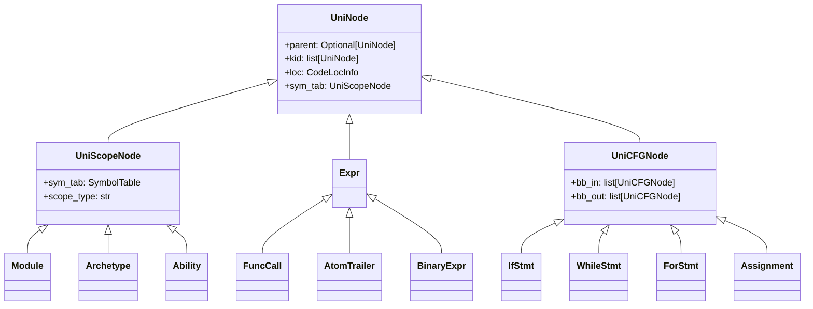
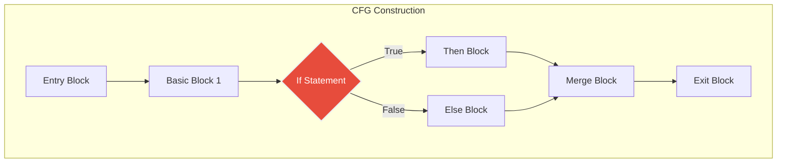

# control_flow


## From: jac_playground.md

#### Basic Examples
- **For Loop** - Learn iteration with for loops
- **While Loop** - Understand conditional looping
- **Conditional Statements** - If/else logic and branching


## From: keywords.md

**Control Flow Statements**

| Keyword | Description |
| --- | --- |
| [`if` / `elif` / `else`](https://www.jac-lang.org/learn/jac_ref/#if-statements) | Executes code blocks conditionally. |
| [`for`](https://www.jac-lang.org/learn/jac_ref/#for-statements) | Iterates over a sequence. |
| [`while`](https://www.jac-lang.org/learn/jac_ref/#while-statements) | Creates a loop that executes as long as a condition is true. |
| [`match` / `case`](https://www.jac-lang.org/learn/jac_ref/#match-statements) | Implements structural pattern matching. |
| [`try` / `except` / `finally`](https://www.jac-lang.org/learn/jac_ref/#try-statements) | Handles exceptions. |
| [`break`](https://www.jac-lang.org/learn/jac_ref/#while-statements) | Exits the current loop. |
| [`continue`](https://www.jac-lang.org/learn/jac_ref/#while-statements) | Proceeds to the next iteration of a loop. |
| [`raise`](https://www.jac-lang.org/learn/jac_ref/#raise-statements) | Triggers an exception. |


## From: syntax_quick_reference.md

```jac
def learnFlowControl() {
	x = 9;

	# All control blocks require brackets, but not parentheses
	if x < 5 {
		print("Doesn't run");
	} elif x < 10 {
		print("Run");
	} else {
		print("Also doesn't run");
	}

	# chains of if-else can be replaced with match statements
	match x {
		case 1:
			print("Exactly one");
		case int() if 10 <= x < 15:
			print("Within a range");
		case _:
			print("Everything else");
	}

	# Like if, for doesn't use parens either.
	# jac provides both indexed and range-based for loops
	for i = 10 to i <= 20 by i += 2 {
		print(f"element: {i}");
	}

	for x in ["a", "b", "c"] {
		print(f"element: {x}");
	}

	# while loops follow similar syntax
	a = 4;
	while a != 1{
		a /= 2;
	}

	learnCollections();
	learnSpecial();
}
```


## From: beginners_guide_to_jac.md

Programs need to make decisions based on conditions. This is where `if`, `elif`, and `else` come in.

### 4.1 The If Statement

```jac
with entry {
    age = 18;

    if age >= 18 {
        print("You are an adult");
    }
}
```

**How it works:**
- `if age >= 18` - Check if age is greater than or equal to 18
- If the condition is `True`, run the code inside `{}`
- If the condition is `False`, skip the code inside `{}`

### 4.2 Comparison Operators

These let you compare values:

| Operator | Meaning | Example |
|----------|---------|---------|
| `>` | Greater than | `x > 5` |
| `<` | Less than | `x < 10` |
| `>=` | Greater than or equal | `age >= 18` |
| `<=` | Less than or equal | `score <= 100` |
| `==` | Equal to | `name == "Alice"` |
| `!=` | Not equal to | `status != "done"` |

**Important:** Use `==` to compare (not `=`). Use `=` to assign values!

### 4.3 If-Else

What if you want to do something when the condition is `False`?

```jac
with entry {
    temperature = 72;

    if temperature > 75 {
        print("It's hot outside!");
    } else {
        print("It's nice outside!");
    }
}
```

### 4.4 If-Elif-Else

What about multiple conditions?

```jac
with entry {
    score = 85;

    if score >= 90 {
        print("Grade: A");
    } elif score >= 80 {
        print("Grade: B");
    } elif score >= 70 {
        print("Grade: C");
    } elif score >= 60 {
        print("Grade: D");
    } else {
        print("Grade: F");
    }
}
```

**How it works:**
1. Check first `if` - if `True`, run its code and skip the rest
2. If first is `False`, check first `elif`
3. Keep checking until one is `True`
4. If none are `True`, run `else` block

### 4.5 Combining Conditions

You can combine multiple conditions:

```jac
with entry {
    age = 25;
    has_license = True;

    # AND - both must be true
    if age >= 16 and has_license {
        print("You can drive!");
    }

    # OR - at least one must be true
    if age < 18 or age > 65 {
        print("Discounted ticket price!");
    }

    # NOT - reverse the condition
    if not has_license {
        print("You need a license!");
    }
}
```

### 4.6 Nested Ifs

You can put `if


## From: dspfoundation.md

### Additional Flow Control Statements

To provide finer control over walker traversal execution, OSP includes two additional specialized flow control statements that operate within the context of object-spatial execution:

**Skip Statement**

The **skip** statement allows a walker to immediately terminate execution at its current location and proceed to the next location in its traversal queue:

$$\text{skip}(w) \Rightarrow L(w) \leftarrow \text{dequeue}(Q_w)$$

where:
- $w$ is the active walker instance with current location $L(w)$
- $Q_w$ is the walker's traversal queue with at least one queued location

When a skip statement is executed:
- All remaining ability execution at the current location is immediately terminated
- Any exit abilities for the current location type are bypassed
- The walker immediately updates its position: $L(w) \leftarrow \text{dequeue}(Q_w)$
- Normal entry ability execution begins at the new location following the established order:
  - First, relevant location entry abilities for the arriving walker type
  - Next, relevant walker entry abilities for the location type

The skip statement is analogous to the *continue* statement in traditional loop constructs, allowing the walker to abort processing at the current location while continuing its overall traversal. This enables efficient implementation of conditional processing logic where certain nodes or edges might be examined but not fully processed based on their properties or the walker's state, providing fine-grained control over the distributed computation process.

**Disengage Statement**

The **disengage** statement allows a walker to immediately terminate its entire object-spatial traversal and return to an inactive object state:

$$\text{disengage}(w) \Rightarrow L(w) \leftarrow \emptyset, Q_w \leftarrow []$$

where:
- $w$ is the active walker instance with current location $L(w) \in N \cup E$

When a disengage statement is executed:
- All remaining ability execution at the current location is immediately terminated
- Any exit abilities for the current location type are bypassed
- The walker's traversal queue is cleared: $Q_w \leftarrow []$
- The walker's location is set to inactive: $L(w) \leftarrow \emptyset$
- The walker transitions from an active participant in the distributed computational system to an inactive object
- The walker retains all its properties and data accumulated during traversal

The disengage statement is analogous to the *break* statement in traditional loop constructs, allowing the walker to completely exit the object-spatial execution context. This enables early termination of traversals when certain conditions are met, such as finding a target node, completing a computation, or encountering an error condition.

Together with the visit statement, these flow control statements provide essential mechanisms for implementing complex traversal algorithms where the path and processing logic may adapt dynamically based on discovered data or computed conditions within the topological structure. They offer precise control over both the walker's movement through the topology and its participation in the distributed computational process that characterizes the OSP model.


## From: superset_python.md

```jac
"""Functions in Jac."""

def factorial(n: int) -> int {
    if n == 0 { return 1; }
    else { return n * factorial(n-1); }
}
```


## From: chapter_6.md

```jac
# Read text file safely
def read_file(filepath: str) -> str | None {
    try {
        with open(filepath, 'r') as file {
            return file.read();
        }
    } except FileNotFoundError {
        print(f"File not found: {filepath}");
        return None;
    } except Exception as e {
        print(f"Error reading file: {e}");
        return None;
    }
}

# Write text file safely
def write_file(filepath: str, content: str) -> bool {
    try {
        with open(filepath, 'w') as file {
            file.write(content);
        }
        return True;
    } except Exception as e {
        print(f"Error writing file: {e}");
        return False;
    }
}

# Read JSON file
def read_json(filepath: str) -> dict | None {
    try {
        with open(filepath, 'r') as file {
            return json.load(file);
        }
    } except FileNotFoundError {
        print(f"JSON file not found: {filepath}");
        return None;
    } except json.JSONDecodeError {
        print(f"Invalid JSON in file: {filepath}");
        return None;
    }
}

with entry {
    # Test file operations
    test_content = "Hello from Jac!";
    if write_file("test.txt", test_content) {
        content = read_file("test.txt");
        print(f"File content: {content}");
    }
}
```
```jac
impl ConfigReader.load_config {
    if not os.path.exists(self.config_file) {
        print(f"Config file {self.config_file} not found, creating default");
        self.create_default_config();
        return True;
    }

    try {
        with open(self.config_file, 'r') as file {
            self.config_data = json.load(file);
        }
        print(f"Config loaded from {self.config_file}");
        return True;
    } except json.JSONDecodeError {
        print(f"Invalid JSON in {self.config_file}");
        return False;
    } except Exception as e {
        print(f"Error loading config: {e}");
        return False;
    }
}
```
```jac
impl ConfigReader.save_config {
    try {
        with open(self.config_file, 'w') as file {
            json.dump(self.config_data, file, indent=2);
        }
        print(f"Config saved to {self.config_file}");
        return True;
    } except Exception as e {
        print(f"Error saving config: {e}");
        return False;
    }
}
```
```jac
impl Application.start {
    print("=== Starting Application ===");

    # Load configuration
    if self.config.load_config() {
        self.setup_logging();

        # Display app info
        app_name = self.config.get_value("app_name", "Unknown App");
        version = self.config.get_value("version", "1.0.0");
        debug_mode = self.config.get_value("debug", False);

        print(f"App: {app_name} v{version}");
        print(f"Debug mode: {debug_mode}");

        # Show database config
        db_config = self.get_database_config();
        print(f"Database: {db_config['host']}:{db_config['port']}/{db_config['name']}");

        if debug_mode {
            self.run_debug_mode();
        } else {
            self.run_normal_mode();
        }
    } else {
        print("Failed to load configuration");
    }
}
```


## From: chapter_1.md

```jac
node Person {
    has name: str;
    has visited: bool = False;  # To keep track of who we've greeted
}

edge FriendsWith;

# This walker will greet every person it meets
walker GreetFriends {
    can greet with Person entry {
        if not here.visited {
            here.visited = True;
            print(f"Hello, {here.name}!");

            # Now, tell the walker to go to all connected friends
            visit [->:FriendsWith:->];
        }
    }
}
```
```jac
node Counter {
    has count: int = 0;

    def increment() -> None;
}

impl Counter.increment {
    self.count += 1;
    print(f"Counter is now: {self.count}");
}

with entry {
    # Get or create counter
    counters = [root-->(`?Counter)];
    if not counters {
        counter = root ++> Counter();
        print("Created new counter");
    }

    # Increment and save automatically
    counter[0].increment();
}
```
```jac
walker GetProfile {
    can get_user_info with entry {
         # 'root' automatically points to the current user's graph
        profiles = [root-->(`?UserProfile)];
        if profiles {
            profile = profiles[0];
            print(f"Profile: {profile.username}");
            print(f"Bio: {profile.bio}");
        } else {
            print("No profile found");
        }
    }
}
```
```jac
# Variables and functions work similarly
def calculate_average(numbers: list[float]) -> float {
    if len(numbers) == 0 {
        return 0.0;
    }
    return sum(numbers) / len(numbers);
}

with entry {
    scores = [85.5, 92.0, 78.5, 96.0, 88.5];
    avg = calculate_average(scores);
    print(f"Average score: {avg}");

    # Control flow is familiar
    if avg >= 90.0 {
        print("Excellent performance!");
    } elif avg >= 80.0 {
        print("Good performance!");
    } else {
        print("Needs improvement.");
    }
}
```
```jac
walker FindCommonInterests {
    # The walker needs to know who we're comparing against.
    has target_person: Person;
    # It will store the results of its search here.
    has common_interests: list[str] = [];

    # This


## From: chapter_10.md

```jac
                if self.checks_done >= self.max_checks {
                    print(f"Reached maximum checks ({self.max_checks})");
                    self.report_final();
                    disengage;  # Stop the walker
                }

                # Skip if no more connections
                connections = [-->];
                if not connections {
                    print("No more students to check");
                    self.report_final();
                    disengage;
                }
```
```jac
                if self.checks_done >= self.max_checks {
                    print(f"Reached maximum checks ({self.max_checks})");
                    self.report_final();
                    disengage;  # Stop the walker
                }

                # Skip if no more connections
                connections = [-->];
                if not connections {
                    print("No more students to check");
                    self.report_final();
                    disengage;
                }
```


## From: chapter_18.md

```jac
                if cached {
                    weather = cached[0];
                    report {
                        "city": weather.city,
                        "temperature": weather.temperature,
                        "description": weather.description,
                        "cached": True
                    };
                } else {
                    # Simulate API call
                    new_weather = WeatherData(
                        city=self.city,
                        temperature=22.5,
                        description="Sunny",
                        last_updated="2024-01-15T10:00:00Z"
                    );
                    here ++> new_weather;

                    report {
                        "city": self.city,
                        "temperature": 22.5,
                        "description": "Sunny",
                        "cached": False
                    };
                }
```
```jac
            if cached {
                metrics["cache_hits"] += 1;
                weather = cached[0];
                report {
                    "city": weather.city,
                    "temperature": weather.temperature,
                    "description": weather.description,
                    "cached": True
                };
            } else {
                metrics["cache_misses"] += 1;
                # Simulate external API call
                new_weather = WeatherData(
                    city=self.city,
                    temperature=22.5,
                    description="Sunny",
                    last_updated=datetime.now().isoformat()
                );
                here ++> new_weather;

                report {
                    "city": self.city,
                    "temperature": 22.5,
                    "description": "Sunny",
                    "cached": False
                };
            }
```
```jac
            status = "healthy";
            if metrics["requests_total"] == 0 and time() - metrics["start_time"] > 300 {
                status = "warning";  # No requests in 5 minutes
            }
```


## From: chapter_11.md

```jac
for person in nyc {
    print(f"  {person.name}, age {person.age}");
}
```
```jac
for person in young_nyc {
    print(f"  {person.name}, age {person.age}");
}
```
```jac
for friend in close_friends {
    print(f"  {friend.name}");
}
```
```jac
for person in young_family {
    print(f"  {person.name}, age {person.age}");
}
```
```jac
for person in nyc_connections {
    print(f"  {person.name}");
}
```
```jac
for person in friends_of_friends {
    print(f"  {person.name}");
}
```
```jac
for child in children {
    child.level = here.level + 1;
}
visit children;
```
```jac
for child in children {
    child.level = here.level + 1;
}
visit :0: children;
```
```jac
for person in all_people {
    person.level = 0;
}
```
```jac
if connections {
    print(f"  Found {len(connections)} connections");
    for conn in connections {
        print(f"    {conn.name} (priority: {conn.priority})");
    }

    # Visit highest priority first using :0:
    visit :0: connections;
}
```


## From: chapter_17.md

```jac
walker visit_profile {
    can visit_profile with `root entry {
        visit [-->Profile] else {
            new_profile = here ++> Profile();
            visit new_profile;
        }
    }
}
```

```jac
walker follow_request {
    can follow_user with Profile entry {
        current_profile = [root --> Profile][0];
        if current_profile != here {
            current_profile +>:Follow:+> here;
            here.follower_count += 1;
            report {"message": f"Now following {here.username}"};
        } else {
            report {"error": "Cannot follow yourself"};
        }
    }
}
```

```jac
walker unfollow_request {
    can unfollow_user with Profile entry {
        current_profile = [root --> Profile][0];
        follow_edges = [edge current_profile ->:Follow:-> here];
        if follow_edges {
            del follow_edges[0];
            here.follower_count -= 1;
            report {"message": f"Unfollowed {here.username}"};
        } else {
            report {"error": "Not following this user"};
        }
    }
}
```

```jac
walker like_tweet {
    can like_post with Tweet entry {
        current_profile = [root --> Profile][0];
        existing_likes = [edge current_profile ->:Like:-> here];

        if not existing_likes {
            current_profile +>:Like:+> here;
            here.like_count += 1;
            report {"message": "Tweet liked"};
        } else {
            report {"error": "Already liked this tweet"};
        }
    }
}
```

```jac
walker unlike_tweet {
    can unlike_post with Tweet entry {
        current_profile = [root --> Profile][0];
        like_edges = [edge current_profile ->:Like:-> here];

        if like_edges {
            del like_edges[0];
            here.like_count -= 1;
            report {"message": "Tweet unliked"};
        } else {
            report {"error": "Haven't liked this tweet"};
        }
    }
}
```

```jac
test error_conditions {
    # Test operations without profile
    try {
        root spawn create_tweet(content="No profile tweet");
        check False;  # Should not reach here
    } except Exception {
        check True;  # Expected behavior
    }

    # Create profile for other tests
    root spawn visit_profile();
    root spawn update_profile(new_username="test_user");

    # Test self-follow prevention
    alice_profile = [root --> Profile][0];
    result = alice_profile spawn follow_request();

    # Should not create self-follow
    self_follows = [alice_profile ->:Follow:-> alice_profile];
    check len(self_follows) == 0;
}
```

```jac
walker debug_graph {
    has visited_nodes: list[str] = [];
    has visited_edges: list[str] = [];
    has max_depth: int = 3;
    has current_depth: int = 0;

    can debug_node with Profile entry {
        if self.current_depth >= self.max_depth {
            print(f"Max depth {self.max_depth} reached at {here.username}");
            return;
        }

        node_info = f"Profile: {here.username} (followers: {here.follower_count})";
        self.visited_nodes.append(node_info);
        print(f"Depth {self.current_depth}: {node_info}");

        # Debug outgoing relationships
        following = [->:Follow:->];
        tweets = [->:Post:->];

        print(f"  Following: {len(following)} users");
        print(f"  Posted: {len(tweets)} tweets");

        # Visit connected nodes
        self.current_depth += 1;
        visit following;
        visit tweets;
        self.current_depth -= 1;
    }
```

```jac
walker feed_loader {
    has user_id: str;
    has loaded_tweets: list[dict] = [];
    has users_visited: set[str] = set();
    has errors: list[str] = [];

    can load_user_feed with Profile entry {
        if here.username in self.users_visited {
            self.errors.append(f"Duplicate visit to {here.username}");
            return;
        }

        self.users_visited.add(here.username);

        # Load user's tweets
        user_tweets = [->:Post:-> Tweet];
        for tweet in user_tweets {
            tweet_data = {
                "author": here.username,
                "content": tweet.content,
                "likes": tweet.like_count,
                "created_at": tweet.created_at
            };
            self.loaded_tweets.append(tweet_data);
        }

        # Visit followed users
        following = [->:Follow:-> Profile];
        visit following;
    }
}
```

```jac
test large_graph_performance {
    start_time = time.time();

    # Create large social network
    root spawn visit_profile();
    root spawn update_profile(new_username="central_user");

    # Create many users and connections
    num_users = 100;
    users = [];

    for i in range(num_users) {
        user = Profile(username=f"user_{i}");
        users.append(user);

        # Every 10th user follows central user
        if i % 10 == 0 {
            user spawn follow_request();
        }
    }
```

```jac
test memory_efficiency {
    # Test memory usage with large datasets
    initial_profiles = len([root --> Profile]);

    # Create and delete many objects
    for batch in range(5) {
        # Create batch of tweets
        for i in range(20) {
            root spawn create_tweet(content=f"Batch {batch} tweet {i}");
        }

        # Delete half of them
        tweets = [root --> Profile ->:Post:-> Tweet];
        for i in range(10) {
            if len(tweets) > i {
                tweets[i] spawn remove_tweet();
            }
        }
    }
```

```jac
walker get_recommendations(visit_profile) {
    has limit: int = 5;
    has algorithm: str = "hybrid";
    has recommendations: list[dict] = [];

    can generate_recommendations with Profile entry {
        current_user = here;
        followed_users = [->:Follow:-> Profile];
        followed_usernames = set([user.username for user in followed_users]);

        # Get all users except current and already followed
        all_users = [root --> Profile](?username != current_user.username);
        candidate_users = [user for user in all_users
                         if user.username not in followed_usernames];

        # Score each candidate
        for candidate in candidate_users {
            score = self.calculate_recommendation_score(
                current_user, candidate, followed_users
            );

            if score > 0 {
                self.recommendations.append({
                    "username": candidate.username,
                    "score": score,
                    "reason": self.get_recommendation_reason(
                        current_user, candidate, followed_users
                    )
                });
            }
        }

        # Sort by score and limit results
        self.recommendations.sort(key=lambda x: x["score"], reverse=True);
        self.recommendations = self.recommendations[:self.limit];

        report self.recommendations;
    }

    def calculate_recommendation_score(
        current_user: Profile,
        candidate: Profile,
        followed_users: list[Profile]
    ) -> float {
        score = 0.0;

        if self.algorithm in ["friend_based", "hybrid"] {
            # Friend of friend scoring
            candidate_followers = [candidate <-:Follow:<- Profile];
            mutual_connections = set([u.username for u in followed_users]) &
                               set([u.username for u in candidate_followers]);
            score += len(mutual_connections) * 2.0;
        }

        if self.algorithm in ["interest_based", "hybrid"] {
            # Interest-based scoring using tweet content
            current_tweets = [current_user ->:Post:-> Tweet];
            candidate_tweets = [candidate ->:Post:-> Tweet];

            # Simple keyword matching (in real system, use embeddings)
            current_words = set();
            for tweet in current_tweets {
                current_words.update(tweet.content.lower().split());
            }

            candidate_words = set();
            for tweet in candidate_tweets {
                candidate_words.update(tweet.content.lower().split());
            }

            common_words = current_words & candidate_words;
            score += len(common_words) * 0.5;
        }

        return score;
    }

    def get_recommendation_reason(
        current_user: Profile,
        candidate: Profile,
        followed_users: list[Profile]
    ) -> str {
        # Determine primary reason for recommendation
        candidate_followers = [candidate <-:Follow:<- Profile];
        mutual_connections = set([u.username for u in followed_users]) &
                           set([u.username for u in candidate_followers]);

        if mutual_connections {
            return f"Friends with {list(mutual_connections)[0]}";
        }

        return "Similar interests";
    }
}
```


## From: chapter_3.md

Jac uses control flow statements like `if`, `elif`, and `else` for this, using curly braces {} to group the code for each block.


### If Statements
An `if` statement allows you to execute code conditionally based on whether a certain condition is true. In Jac, we use curly braces `{}` to define the block of code that should be executed if the condition is met.

Let's now fix our `divide` function. With an `if` statement, we can check if the second number is zero before we try to do the division. This allows us to handle the problem gracefully instead of letting our program crash.

```jac
# We can specify multiple possible return types using the '|' symbol.
def divide(a: float, b: float) -> float | str {
    # Check if b is zero before dividing.
    if b == 0.0 {
        return "Error: Cannot divide by zero!";
    }
    # If b is not zero, we can safely perform the division.
    return a / b;
}
```
In this updated function, we first check if b is equal to 0.0. If the condition is `True`, the code inside the curly braces {} is executed, and the function returns an error message. If the condition is `False`, the `if` block is skipped, and the function proceeds to the next line to perform the division.

### Conditional Logic `if-elif-else`

Often, you'll need to check for more than just one condition. For these situations, you can use a chain of `if`, `elif` (short for "else if"), and `else` statements. This lets you create a clear path for your program to follow based on different possibilities.

Let's expand on our gradebook example by creating a function that assigns a letter grade based on a score. We'll use a list comprehension to apply this function to a whole list of scores.


```jac
def classify_grade(score: int) -> str {
    if score >= 90 {
        return "A";
    } elif score >= 80 {
        return "B";
    } elif score >= 70 {
        return "C";
    } elif score >= 60 {
        return "D";
    } else {
        return "F";
    }
}

with entry {
    # Raw test scores
    test_scores: list[int] = [78, 85, 92, 69, 88, 95, 72];

    # Get passing grades (70 and above)
    passing_scores: list[int] = [score for score in test_scores if score >= 70];
    print(f"Passing scores: {passing_scores}");

    # Apply curve (+5 points)
    curved_scores: list[int] = [score + 5 for score in test_scores];
    print(f"


## From: chapter_13.md

```jac
walker get_counter {
    obj __specs__ {
        static has auth: bool = False;
    }

    can get_counter_endpoint with `root entry {
        counter_nodes = [root --> Counter];


        if not counter_nodes {
            counter = Counter();
            root ++> counter;
        } else {
            counter = counter_nodes[0];
        }

        report {"value": counter.get_value()};
    }
}
```

```jac
walker increment_counter {
    obj __specs__ {
        static has auth: bool = False;
    }

    can increment_counter_endpoint with `root entry {
        counter_nodes = [root --> Counter];
        if not counter_nodes {
            counter = Counter();
            root ++> counter;
        } else {
            counter = counter_nodes[0];
        }
        new_value = counter.increment();
        report {"value": new_value};
    }
}
```

```jac
walker get_counter {
    can get_counter_endpoint with `root entry {
        counter_nodes = [root --> Counter];
        if not counter_nodes {
            counter = Counter(created_at="2024-01-15");
            root ++> counter;
            report {"value": 0, "status": "created"};
        } else {
            counter = counter_nodes[0];
            report {"value": counter.value, "status": "existing"};
        }
    }
}
```

```jac
walker increment_counter {
    can increment_counter_endpoint with `root entry {
        counter_nodes = [root --> Counter];
        if not counter_nodes {
            counter = Counter(created_at="2024-01-15");
            root ++> counter;
        } else {
            counter = counter_nodes[0];
        }
        new_value = counter.increment();
        report {"value": new_value, "previous": new_value - 1};
    }
}
```

```jac
walker reset_counter {
    can reset_counter_endpoint with `root entry {
        counter_nodes = [root --> Counter];
        if counter_nodes {
            counter = counter_nodes[0];
            counter.reset();
            report {"value": 0, "status": "reset"};
        } else {
            report {"value": 0, "status": "no_counter_found"};
        }
    }
}
```

```jac
walker get_counter_with_history {
    obj __specs__ {
        static has auth: bool = False;
    }

    can get_counter_with_history_endpoint with `root entry {
        counter_nodes = [root --> Counter];
        if not counter_nodes {
            counter = Counter(created_at=str(datetime.now()));
            root ++> counter;
            report {
                "value": 0,
                "status": "created",
                "history": []
            };
        } else {
            counter = counter_nodes[0];
            report {
                "value": counter.value,
                "status": "existing",
                "history": counter.get_history()
            };
        }
    }
}
```

```jac
walker increment_with_history {
    obj __specs__ {
        static has auth: bool = False;
    }

    can increment_with_history_endpoint with `root entry {
        counter_nodes = [root --> Counter];
        if not counter_nodes {
            counter = Counter(created_at=str(datetime.now()));
            root ++> counter;
        } else {
            counter = counter_nodes[0];
        }

        new_value = counter.increment();
        report {
            "value": new_value,
            "history": counter.get_history()
        };
    }
}
```

```jac
def create_counter(name: str) -> dict {
    # Check if counter already exists
    existing = [self --> Counter](?name == name);
    if existing {
        return {"status": "exists", "counter": existing[0].name};
    }

    new_counter = Counter(name=name, value=0);
    self ++> new_counter;
    return {"status": "created", "counter": name};
}
```

```jac
walker create_counter {
    has name: str;

    obj __specs__ {
        static has auth: bool = False;
    }

    can create_counter_endpoint with `root entry {
        manager_nodes = [root --> CounterManager];
        if not manager_nodes {
            manager = CounterManager(created_at=str(datetime.now()));
            root ++> manager;
        } else {
            manager = manager_nodes[0];
        }

        result = manager.create_counter(self.name);
        report result;
    }
}
```

```jac
walker increment_named_counter {
    has name: str;
    has amount: int = 1;

    obj __specs__ {
        static has auth: bool = False;
    }

    can increment_named_counter_endpoint with `root entry {
        manager_nodes = [root --> CounterManager];
        if not manager_nodes {
            report {"error": "No counter manager found"};
            return;
        }

        manager = manager_nodes[0];
        counters = [manager --> Counter](?name == self.name);

        if not counters {
            report {"error": f"Counter {self.name} not found"};
            return;
        }

        counter = counters[0];
        new_value = counter.increment(self.amount);
        report {"name": self.name, "value": new_value};
    }
}
```

```jac
walker get_all_counters {
    obj __specs__ {
        static has auth: bool = False;
    }

    can get_all_counters_endpoint with `root entry {
        manager_nodes = [root --> CounterManager];
        if not manager_nodes {
            report {"counters": [], "total": 0};
            return;
        }

        manager = manager_nodes[0];
        report {
            "counters": manager.list_counters(),
            "total": manager.get_total()
        };
    }
}
```


## From: chapter_14.md

```jac
            if not target_note {
                report {"error": "Note not found"};
                return;
            }

            note = target_note[0];

            # Only owner can share notes
            if note.owner != self.current_user {
                report {"error": "Only note owner can share"};
                return;
            }

            # Add user to shared list if not already there
            if self.target_user not in note.shared_with {
                note.shared_with.append(self.target_user);
            }
```
```jac
            for note in all_notes {
                # User can access if:
                # 1. They own it
                # 2. It's shared with them
                # 3. It's public
                if (note.owner == self.user_id or
                    self.user_id in note.shared_with or
                    note.is_public) {

                    accessible_notes.append({
                        "id": note.id,
                        "title": note.title,
                        "owner": note.owner,
                        "is_mine": note.owner == self.user_id,
                        "access_type": "owner" if note.owner == self.user_id
                                    else ("shared" if self.user_id in note.shared_with
                                        else "public")
                    });
                }
            }
```
```jac
            if user_profile {
                current_role = user_profile[0].role;
            } else {
                # Create default profile for new user
                new_profile = UserProfile(email=self.user_id);
                here ++> new_profile;
                current_role = Role.VIEWER;
            }
```
```jac
            if not user_profile {
                report {"error": "User profile not found"};
                return;
            }
```
```jac
            # Check if user can create sensitive notes
            if self.is_sensitive and user_role == Role.VIEWER {
                report {"error": "Insufficient permissions for sensitive content"};
                return;
            }
```
```jac
            if not user_profile {
                report {"notes": [], "message": "No user profile found"};
                return;
            }
```
```jac
            for note in all_notes {
                # Check if user meets role requirement
                can_access = (
                    note.owner == self.user_id or  # Always access own notes
                    (user_role == Role.ADMIN) or  # Admins see everything
                    (user_role == Role.EDITOR and note.required_role != Role.ADMIN) or
                    (user_role == Role.VIEWER and note.required_role == Role.VIEWER)
                );

                if can_access {
                    accessible_notes.append({
                        "id": note.id,
                        "title": note.title,
                        "owner": note.owner,
                        "required_role": note.required_role.value,
                        "is_sensitive": note.is_sensitive
                    });
                }
            }
```
```jac
            if user_profile {
                current_role = user_profile[0].role;
            } else {
                # Create default profile for new user
                new_profile = UserProfile(email=self.user_id);
                here ++> new_profile;
                current_role = Role.VIEWER;
            }
```
```jac
            if not user_profile {
                report {"error": "User profile not found"};
                return;
            }
```
```jac
            # Check if user can create sensitive notes
            if self.is_sensitive and user_role == Role.VIEWER {
                report {"error": "Insufficient permissions for sensitive content"};
                return;
            }
```
```jac
            if not user_profile {
                report {"notes": [], "message": "No user profile found"};
                return;
            }
```
```jac
            for note in all_notes {
                # Check if user meets role requirement
                can_access = (
                    note.owner == self.user_id or  # Always access own notes
                    (user_role == Role.ADMIN) or  # Admins see everything
                    (user_role == Role.EDITOR and note.required_role != Role.ADMIN) or
                    (user_role == Role.VIEWER and note.required_role == Role.VIEWER)
                );

                if can_access {
                    accessible_notes.append({
                        "id": note.id,
                        "title": note.title,
                        "owner": note.owner,
                        "required_role": note.required_role.value,
                        "is_sensitive": note.is_sensitive
                    });
                }
            }
```


## From: permission.md

```jac
        for member_id in self.team_members {
            _.allow_root(here, NodeAnchor.ref(member_id), self.access_level);
        }
```
```jac
        if is_friend {
            # Grant access if they're friends
            _.allow_root(here, NodeAnchor.ref(self.viewer_id), "READ");
            report "Access granted to friend!";
        } else {
            report "Access denied - not a friend!";
        }
```


## From: quickstart.md

```jac
    can search_by_name with `root entry{
        for user in self.users {
            if user['username'] == self.query {
                report user;
                return;
            }
        }

        report {
            "error": f"User with username {self.query} not found"
        };
    }
```


## From: static_fx.md

```python
def forward(self, x):
    # Traceable
    x = self.linear1(x)

    # GRAPH BREAK: Data-dependent control flow
    if x.sum() > 0:  # Cannot evaluate Proxy to bool
        x = self.linear2(x)
    else:
        x = self.linear3(x)

    # New graph starts here
    return self.output(x)
```

**Common Graph Break Causes**:

1. Data-dependent conditionals (`if tensor.sum() > 0`)
2. Data-dependent loops (`for i in range(tensor.item())`)
3. Python I/O operations (`print`, file operations)
4. Unsupported Python builtins (`getattr`, `inspect` module)
5. Dynamic attribute access
6. Certain tensor operations that create dynamic shapes



##### CFGBuildPass

**Purpose**: Builds control flow graphs for program analysis

**Location**: `jac/jaclang/compiler/passes/main/cfg_build_pass.py`

**Key Operations**:
- Identifies basic blocks (straight-line code sequences)
- Links basic blocks with control flow edges
- Tracks loop structures
- Handles conditional branches

**CFG Structure**:



**Basic Block Connections**:
```python
class UniCFGNode(UniNode):
    """Node participating in control flow"""
    bb_in: list[UniCFGNode]   # Incoming edges
    bb_out: list[UniCFGNode]  # Outgoing edges
```

```python
# Before
if condition:
    x = tensor_a
else:
    x = tensor_b

# After (transformed to)
x = torch.where(condition, tensor_a, tensor_b)
```

```python
    def process_conditional(self, node: uni.IfStmt) -> None:
        """Handle if statements"""
        condition_expr = node.condition

        # Check if condition is data-dependent
        if self.is_data_dependent(condition_expr):
            # Mark as graph break
            break_region = GraphBreakRegion(
                reason="data_dependent_control_flow",
                nodes=[],  # Will be populated
                source_loc=node.loc,
                workaround="Consider using torch.where() or masking"
            )
            self.graph_break_regions.append(break_region)

            # Still process both branches (record them)
            self.process_branch_with_tag(node.body, "then_branch", break_region)
            if node.else_body:
                self.process_branch_with_tag(node.else_body.body, "else_branch", break_region)
        else:
            # Statically resolvable - can safely include
            # (e.g., if check based on model config, not tensor values)
            pass

    def is_data_dependent(self, expr: uni.Expr) -> bool:
        """Check if expression depends on tensor runtime values"""
        # Data-dependent if:
        # - Tensor item() call
        # - Tensor comparison (tensor > 0)
        # - Tensor shape/size accessed as value
        # - Any operation on tensor producing scalar bool

        # Find all tensor operations in expression
        tensor_ops = self.find_tensor_operations(expr)
        return any(self.produces_runtime_value(op) for op in tensor_ops)

    def process_loop(self, node: uni.UniNode) -> None:
        """Handle loops"""
        if isinstance(node, uni.InForStmt):
            # Check if loop bounds are static
            if self.has_static_bounds(node):
                # Unroll the loop
                self.unroll_loop(node)
            else:
                # Dynamic loop - graph break
                break_region = GraphBreakRegion(
                    reason="dynamic_loop",
                    nodes=[],
                    source_loc=node.loc,
                    workaround="Use static loop bounds or vectorize"
                )
                self.graph_break_regions.append(break_region)
                # Still record loop body with tag
                self.process_loop_body_with_tag(node.body, break_region)
```

```python
    def process_if_statement(self, stmt: uni.IfStmt) -> None:
        """Process if statement - check for data dependency"""

        condition = stmt.condition

        # Check if condition depends on tensor values
        if self.is_data_dependent_condition(condition):
            # This is a graph break!
            reason = "Data-dependent control flow (if statement)"

            # Create graph break region
            region = GraphBreakRegion(
                reason=reason,
                source_loc=stmt.loc,
                severity="warning",
            )

            # Still process both branches to record operations
            self.process_branch_with_annotation(
                stmt.body,
                region,
                branch_type="then"
            )

            if stmt.else_body:
                self.process_branch_with_annotation(
                    stmt.else_body.body,
                    region,
                    branch_type="else"
                )

            self.current_graph.graph_break_regions.append(region)

        else:
            # Static condition - safe to trace
            # (Could evaluate at compile time)
            for s in stmt.body:
                self.process_statement(s)

            if stmt.else_body:
                for s in stmt.else_body.body:
                    self.process_statement(s)

    def is_data_dependent_condition(self, condition: uni.Expr) -> bool:
        """Check if condition depends on runtime tensor values"""

        # Look for patterns that indicate data dependency:
        # 1. Tensor comparisons: x > 0, x.sum() > threshold
        # 2. Tensor.item() calls
        # 3. Tensor bool evaluation

        # Find all function calls in condition
        calls = self.get_all_sub_nodes(condition, uni.FuncCall)

        for call in calls:
            # Check for .item()
            if self.is_tensor_item_call(call):
                return True

        # Check for tensor comparisons
        comparisons = self.get_all_sub_nodes(condition, uni.BinaryExpr)
        for comp in comparisons:
            if self.involves_tensor_comparison(comp):
                return True

        return False

    def process_for_loop(self, stmt: uni.InForStmt) -> None:
        """Process for loop - check for dynamic bounds"""

        # Check if loop has static bounds
        if self.has_static_loop_bounds(stmt):
            # Can unroll the loop
            self.unroll_static_loop(stmt)
        else:
            # Dynamic loop bounds - graph break
            region = GraphBreakRegion(
                reason="Dynamic loop bounds",
                source_loc=stmt.loc,
                severity="warning",
                workaround="Use static loop bounds or vectorize operations"
            )

            # Process loop body with annotation
            self.process_loop_body_with_annotation(stmt.body, region)

            self.current_graph.graph_break_regions.append(region)

    def has_static_loop_bounds(self, stmt: uni.InForStmt) -> bool:
        """Check if for loop has compile-time known bounds"""

        # Check if iterating over:
        # - range(constant)
        # - List literal
        # - Other static iterables

        collection = stmt.collection

        if isinstance(collection, uni.FuncCall):
            # Check for range(N) where N is constant
            if self.is_range_with_constant(collection):
                return True

        elif isinstance(collection, uni.ListVal):
            # List literal - static
            return True

        return False

    def unroll_static_loop(self, stmt: uni.InForStmt) -> None:
        """Unroll loop with static bounds"""

        # Get loop iterations
        iterations = self.get_loop_iterations(stmt)

        # Process body for each iteration
        for iter_value in iterations:
            # Bind loop variable
            loop_var = stmt.target.value
            # Create node for iteration value
            # Process body statements
            for body_stmt in stmt.body:
                self.process_statement(body_stmt)
```


## From: async_walker.md

```jac
        for item in dataset{
            # Do intensive processing
            processed = complex_computation(item);
            self.results.append(processed);
        }
```

```jac
        if process.__jac__.schedule.status == "COMPLETED"{
            print("Results:", process.results);
        }
        else{
            print("Still processing...");
        }
```

```jac
        for item in data{
            process_item(item);
        }
```

```jac
        for item in external_data{
            result = process_and_save(item);
            self.sync_results.append(result);
        }
```

```jac
        for i in range(10){
            process_chunk(i);
            self.progress = (i+1) * 10;

            # Send progress update via WebSocket
            socket.notify_clients([self.client_id], {
                "type": "progress",
                "data": {"progress": self.progress}
            });
        }
```

```jac
        try {
            # Attempt processing
            data = fetch_data(self.input_id);
            if not data{
                self.error_message = "No data found";
                return;
            }

            self.results = process_data(data);
            self.success = True;
        } except e {
            # Capture error details
            self.error_message = str(e);
            log_error(self.input_id, str(e));
        }
```


## From: jaclang.md

- **Support iter for statement**: Iter for statement is supported in order to utilize traditional for loop in javascript.
- **Switch Case Statement**: Switch statement is introduced and javascript style fallthrough behavior is also supported.
- **Typed Context Blocks (OSP)**: Fully implemented typed context blocks (`-> NodeType { }` and `-> WalkerType { }`) for Object-Spatial Programming, enabling conditional code execution based on runtime types.
- **Bug fix on supporting while loop with else part**: Now we are supporting while loop with else part.
- **Concurrent Execution with `flow` and `wait`**: Introduced `flow` and `wait` keywords for concurrent expressions. `flow` initiates parallel execution of expressions, and `wait` synchronizes these parallel operations. This enables efficient parallel processing and asynchronous operations directly within Jac with separate (and better) semantics than python's async/await.


## From: cli.md

- `cfg.`: Genarates a dot graph of the control flow graph(s) for the specified .jac file.


## From: FAQ.md

```jac
        # Series connection (one after the other)
        node_1 ++> node_list[0];
        for i to i < length(node_list) by i+=1 {
            node_list[i] ++> node_list[i+1];
        }
```


## From: streamlit.md

```jac
    # Calculate result
    if st.button("Calculate") {
        if operation == "Add" {
            result = num1 + num2;
        } elif operation == "Subtract" {
            result = num1 - num2;
        } elif operation == "Multiply" {
            result = num1 * num2;
        } elif operation == "Divide" {
            if num2 != 0 {
                result = num1 / num2;
            } else {
                st.error("Cannot divide by zero!");
                return;
            }
        }

        st.success("Result: " + str(result));

        # Add to history
        if "history" not in st.session_state {
            st.session_state.history = [];
        }

        st.session_state.history.append(
            str(num1) + " " + operation.lower() + " " + str(num2) + " = " + str(result)
        );
    }
```
```jac
    # Display todos
    if st.session_state.todos {
        st.subheader("📝 Your Todos");

        todos_to_remove = [];

        for todo in st.session_state.todos {
            columns = st.columns([4, 1]);

            with columns[0] {
                st.write("• " + todo);
            }

            with columns[1] {
                if st.button("Remove", key=todo) {
                    todos_to_remove.append(todo);
                }
            }
        }

        # Remove completed todos
        for todo in todos_to_remove {
            st.session_state.todos.remove(todo);
        }

        if todos_to_remove {
            st.rerun();
        }

        # Clear all button
        if st.button("Clear All") {
            st.session_state.todos = [];
            st.rerun();
        }
    } else {
        st.info("No todos yet! Add one above.");
    }

    # Show count
    if st.session_state.todos {
        st.write("Total todos: " + str(len(st.session_state.todos)));
    }
```
```jac
    if chart_type == "bar" {
        st.bar_chart(data);
    } elif chart_type == "area" {
        st.area_chart(data);
    }
```
```jac
    if not st.session_state.token {
        with st.form("login_form") {
            email = st.text_input("Email");
            password = st.text_input("Password", type="password");

            if st.form_submit_button("Login") {
                # Attempt login
                response = requests.post(
                    "http://localhost:8000/user/login",
                    json={"email": email, "password": password}
                );

                if response.status_code == 200 {
                    st.session_state.token = response.json()["token"];
                    st.rerun();
                } else {
                    st.error("Login failed!");
                }
            }
        }
    } else {
        st.success("Logged in successfully!");

        # Your app content here
        user_input = st.text_input("Enter your message:");

        if st.button("Send") and user_input {
            result = make_api_call(
                st.session_state.token,
                "walker/interact",
                {"message": user_input}
            );

            if result {
                st.write("Response:", result);
            }
        }
    }
```


## From: fantasy_trading_game.md

```jac
def make_transaction(buyer_name: str, seller_name: str, item_name: str, price: int| None = None) -> bool {
    buyer = person_record[buyer_name];
    seller = person_record[seller_name];

    # Find item in seller's inventory
    item_to_buy = None;
    item_index = -1;
    for i in range(len(seller.inventory)) {
        if seller.inventory[i].name.lower() == item_name.lower() {
            item_to_buy = seller.inventory[i];
            item_index = i;
            break;
        }
    }

    price = price or item_to_buy.price;

    # Validate transaction
    if not item_to_buy or buyer.money < price {
        return False;
    }

    # Execute transfer
    buyer.money -= price;
    seller.money += price;
    buyer.inventory.append(item_to_buy);
    seller.inventory.pop(item_index);
    return True;
}
```
```jac
with entry {
    # Generate characters using AI functions
    player = make_player();
    npc = make_random_npc();

    # Register characters for transactions
    person_record[player.name] = player;
    person_record[npc.name] = npc;

    history = [];

    while True {
        # AI agent generates response with state
        chat = chat_with_player(player, npc, history);
        history.append(chat);

        # Display game state
        for p in [player, npc] {
            print(p.name, ":  $", p.money);
            for i in p.inventory {
                print("  ", i.name, ":  $", i.price);
            }
        }

        # Show NPC response and get player input
        print("\n[[npc]] >> ", chat.message);
        inp = input("\n[[Player input]] >> ");
        history.append(Chat(person=player.name, message=inp));
    }
}
```


## From: rpg_game.md

```jac
def get_next_level -> tuple(Level, Map) {
    self.current_level += 1;

    # Keeping Only the Last 3 Levels
    if len(self.prev_levels) > 3 {
        self.prev_levels.pop(0);
        self.prev_level_maps.pop(0);
    }

    # Generating the New Level
    new_level = self.create_next_level(
        self.prev_levels,
        self.current_difficulty,
        20, 20
    );

    self.prev_levels.append(new_level);

    # Generating the Map of the New Level
    new_level_map = self.create_next_map(new_level);
    self.prev_level_maps.append(new_level_map);

    # Increasing the Difficulty for end of every 2 Levels
    if self.current_level % 2 == 0 {
        self.current_difficulty += 1;
    }

    return (new_level, new_level_map);
}
```
```jac
def get_map(map: Map) -> str {
    map_tiles = [['.' for _ in range(map.level.width)] for _ in range(map.level.height)];

    # Place walls
    for wall in map.walls {
        for x in range(wall.start_pos.x, wall.end_pos.x + 1) {
            for y in range(wall.start_pos.y, wall.end_pos.y + 1) {
                map_tiles[y-1][x-1] = 'B';
            }
        }
    }

    # Place obstacles, enemies, and player
    for obs in map.small_obstacles {
        map_tiles[obs.y-1][obs.x-1] = 'B';
    }
    for enemy in map.enemies {
        map_tiles[enemy.y-1][enemy.x-1] = 'E';
    }
    map_tiles[map.player_pos.y-1][map.player_pos.x-1] = 'P';

    # Add border walls
    map_tiles = [['B'] + row + ['B'] for row in map_tiles];
    map_tiles = [['B' for _ in range(map.level.width + 2)]] + map_tiles + [['B' for _ in range(map.level.width + 2)]];
    return [''.join(row) for row in map_tiles];
}
```
```jac
import from level_manager { LevelManager }

with entry {
    level_manager = LevelManager();

    print("Generating 3 AI-powered levels...\n");

    for i in range(3) {
        level, map_obj = level_manager.get_next_level();
        visual_map = level_manager.get_map(map_obj);

        print(f"=== LEVEL {i+1} ===");
        print(f"Difficulty: {level.difficulty}");
        print(f"Enemies: {level.num_enemies}");
        print(f"Walls: {level.num_wall}");
        print("Map:");
        for row in visual_map {
            print(row);
        }
        print("\n");
    }
}
```

