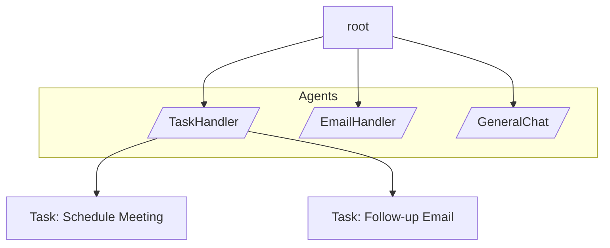

# graphs


## From: tool_suite.md

- Jac Graph visualizer
- To specifically learn how to setup the debugger or graph-visualizer check out the [Debugger Tutorial](https://www.jac-lang.org/learn/debugger/)
- The debugger and graph visualizer included in the Jac VS Code Extension support only local Jac programs. They are not currently compatible with Scale Native. To visualize graphs for Scale Native programs, refer to [Jac Lens](#jac-lens).
- The [Jac Playground](https://www.jac-lang.org/playground/) provides an interactive graph visualizer and online debugger.
- Real-time Graph Visualizer
- Jac Lens is another tool for visualizing your Jac object-spatial graphs. Unlike the VS Code Extension and Jac Playground, Jac Lens specifically supports graph visualization for Scale Native applications.
- To learn how to configure a graph visualizer for your Scale Native program, check out the [Jac Lens Tutorial](https://www.jac-lang.org/learn/jac-lens/)


## From: jac_in_a_flash.md

Finally `guess_game4.jac` re-imagines the game using Jac's object-spatial architecture. A `walker` visits a chain of `turn` nodes created with `++>` edges. The walker moves with `visit [-->]` and stops via `disengage` when the guess is correct. The game is launched by `spawn`ing the walker at `root`. This example shows how conventional logic can become graph traversal.


## From: jac_playground.md

### Jaclang Graph Visualizer


### Jac Playground - Jaclang Graph Visualizer Demo


### Using Debug Mode Effectively

1. **Set breakpoints** by clicking on line numbers in the editor
2. **Start debugging** by clicking the Debug button instead of Run
3. **Navigate execution** using the arrow keys or debug controls
4. **Observe the graph** to understand how your nodes and edges are connected
5. **Step through slowly** to see how data flows through your spatial program structure

The Graph Visualizer makes Jac's spatial programming concepts tangible, allowing you to see exactly how your objects, walkers, and edges interact during program execution.
The Graph Visualizer is one of Jac's most powerful debugging features, providing a real-time visual representation of your program's execution flow. This unique tool shows:


## From: debugger.md

- Graph visualization (unique to Jac)

Jac’s debugger includes a visual graph tool to show nodes and edges.

Example graph program:
```jac
node Person{
    has age: int;
}

with entry {
    # Create people nodes
    jonah = Person(16);
    sally = Person(17);
    teacher = Person(42);
    jonah_mom = Person(45);

    # Connect Jonah to root
    root ++> jonah;

    # Create Jonah's relationships
    jonah ++> jonah_mom;
    jonah ++> teacher;
    jonah ++> sally;
}
```

#### Open visualization panel:

1. Open the VS Code Command Palette
    This can be done by either:
    - On your keyboard pressing `ctrl+shift+p` or `⌘+⇧+p` on mac
    - On the top menu bar pressing `view > command palette`
2. Type `jacvis`
3. Select `jacvis: Visualize Jaclang Graph`

You will see a side panel like this:


#### Watch the Graph Build in Real Time

1. Set a breakpoint in your code
3. Click Run and Debug
3. Step through the program each created node/edge appears in real time

<a href="https://www.youtube.com/watch?v=9bdZn4Zvf9M" target="_blank" class="youtube-video-link">
  
</a>

As shown in the video, these nodes will show their values and can be dragged around to better visualize the data.

| Problem                                | Fix                                                               |
| -------------------------------------- | ----------------------------------------------------------------- |
| Graph doesn't update                   | Open the `jacvis` before starting the debugger              |


## From: jac-lens.md

Jac Lens is a powerful Progressive Web App (PWA) that provides an intuitive visual interface for exploring and managing your Jac graph data. It allows you to connect to your Jac server, navigate through node relationships, and modify node properties in real-time.

-   __Explore Graph__

    ---

    *Navigate node relationships*

    

-   __Update Graph__

    ---

    *Navigate node relationships*

    

Once connected, you can explore your graph:

- **Click on nodes** to view their properties
- **Navigate connections** between nodes
- **Zoom and pan** to explore large graphs
- **Search for specific nodes** using the search functionality

-   __Graph Visualization__

    ---

    *Visual node relationships*

    Interactive graph view with zoom, pan, and node selection

??? failure "Graph Not Loading"
    - Confirm you have the required walkers installed
    - Check your server logs for errors
    - Verify your graph has data to display


## From: tour.md

Jac introduces a new programming model that lets developers articulate relationships between objects in a graph-like structure and express computation as walkers that traverse this graph. This model is particularly effective for applications involving connected data, such as social networks, knowledge graphs, or file systems, and can greatly reduce code complexity. OSP also provides the foundation for agentic workflows and enables Jaseci’s scale-native execution, reducing backend development and deployment overhead.

Jac-lang is intentionally designed as an extension of Python. It provides Python-like syntax while adding new capabilities for graph-based and AI-first programming.

- Your problem domain is inherently graph-like, where relationships between objects matter.


## From: example.md

Using OSP construts, programmers can express object relationships as graphs
Instances of these node and edge classes form a graph structure that expresses semantic relationships between objects.
Computation in OSP occurs by traversing these graphs using two key constructs:
OSP can be used where needed and maps nicely to many categories of problems, espeically those that deal with connected data, such as social network, knowledge graph, file system, dependency graph, etc.
By modeling relationships directly as graph edges and expressing computation through walkers, OSP removes much of the boilerplate needed to manage graphs, traversals, search and state. This makes complex logic simpler, clearer, and more scalable.
```jac
root ++> alice ++> bob ++> charlie;
```


## From: syntax_quick_reference.md

```jac
# Jac also supports graph relationships within the type system
# This is called Object Spatial Programming
```
```jac
    # root is a special named node in all graphs
    root ++> f ++> a;
```


## From: superset_python.md

Jac is designed as a superset of Python, extending the language with additional features for modern software architecture while maintaining full compatibility with the Python ecosystem. Python developers can leverage their existing knowledge while accessing new capabilities for graph


## From: chapter_7.md

In the next chapter, we will make the leap from Object-Oriented to Object-Spatial Programming (OSP). We will see how these objects are extended into nodes that can exist in a graph, giving them a spatial context and unlocking a new way to handle complex, interconnected data.


## From: chapter_10.md

In the previous chapters, you learned how to build the static structure of your application using nodes and edges. Now, you will learn how to put that structure into motion. The primary way you interact with and process your graph is by using walkers.
Walkers are special objects that can move through your graph, carrying state and executing abilities when they encounter different types of nodes and edges.
Walkers move through graphs using `spawn` (to start) and `visit` (to continue to connected nodes). This enables complex traversal patterns with simple syntax.
Walkers can control their movement through the graph using special statements like `visit` and `disengage`.
- **Walkers** are mobile computational entities that traverse graphs
- **Traversal control**: Fine-grained control over movement patterns
- **Spawning mechanism**: Activate walkers at specific graph locations
- **Graph analysis**: Analyze relationships and connections
- **State propagation**: Update related nodes based on changes
- Remember: Walkers bring computation to data - think about how your processing can move through your graph!


## From: chapter_11.md

Complex graph operations become intuitive when you move computation to data. Instead of loading entire datasets, walkers intelligently navigate only the relevant portions of your graph, making sophisticated queries both efficient and expressive.
Advanced filtering combines relationship traversal, node properties, and complex conditions to find exactly the data you need.
```jac
with entry {
    # Create a social network
    alice = root ++> Person(name="Alice", age=25, city="NYC");
    bob = root ++> Person(name="Bob", age=30, city="SF");
    charlie = root ++> Person(name="Charlie", age=22, city="NYC");
    diana = root ++> Person(name="Diana", age=28, city="LA");

    # Create friendships
    alice +>:FriendsWith(since="2020", closeness=8):+> bob;
    alice +>:FriendsWith(since="2021", closeness=9):+> charlie;
    bob +>:FriendsWith(since="2019", closeness=6):+> diana;

    # Find all young people in NYC (age < 25)
    nyc = [root-->(`?Person)](?city == "NYC");
    print("People in NYC:");
    for person in nyc {
        print(f"  {person.name}, age {person.age}");
    }
    young_nyc = nyc(?age < 25);
    print("Young people in NYC:");
    for person in young_nyc {
        print(f"  {person.name}, age {person.age}");
    }

    # Find Alice's close friends (closeness >= 8)
    close_friends = [alice->:FriendsWith:closeness >= 8:->(`?Person)];
    print(f"Alice's close friends:");
    for friend in close_friends {
        print(f"  {friend.name}");
    }

    # Find all friendships that started before 2021
    old_friendships = [root->:FriendsWith:since < "2021":->];
    print(f"Old friendships: {len(old_friendships)} found");
}
```
```jac
with entry {
    # Create extended family network
    john = root ++> Person(name="John", age=45, city="NYC");
    emma = root ++> Person(name="Emma", age=43, city="NYC");
    alice = root ++> Person(name="Alice", age=20, city="SF");
    bob = root ++> Person(name="Bob", age=18, city="NYC");

    # Family relationships
    john +>:FriendsWith(since="1995", closeness=10):+> emma;  # Married
    [john[0], emma[0]] +>:FriendsWith(since="2004", closeness=10):+> alice;  # Parents
    [john[0], emma[0]] +>:FriendsWith(since="2006", closeness=10):+> bob;    # Parents

    # Find John's family members under 25
    young_family = [john[0]->:FriendsWith:closeness == 10:->(`?Person)](?age < 25);
    print("John's young family members:");
    for person in young_family {
        print(f"  {person.name}, age {person.age}");
    }

    # Find all people in NYC connected to John
    nyc_connections = [john[0]->:FriendsWith:->(`?Person)](?city == "NYC");
    print(f"John's NYC connections:");
    for person in nyc_connections {
        print(f"  {person.name}");
    }

    # Find friends of friends (2-hop connections)
    friends_of_friends = [john[0]->:FriendsWith:->->:FriendsWith:->(`?Person)];
    print(f"Friend of friends: {len(friends_of_friends)} found");
    for person in friends_of_friends {
        print(f"  {person.name}");
    }
}
```
Visit patterns control how walkers traverse your graph. The most powerful feature is indexed visiting using `:0:`, `:1:`, etc., which controls the order of traversal.
```jac
with entry {
    # Create family tree
    grandpa = root ++> Person(name="Grandpa");
    dad = root ++> Person(name="Dad");
    mom = root ++> Person(name="Mom");
    child1 = root ++> Person(name="Alice");
    child2 = root ++> Person(name="Bob");
    grandchild = root ++> Person(name="Charlie");

    # Create relationships
    grandpa +>:ParentOf:+> dad;
    grandpa +>:ParentOf:+> mom;
    dad +>:ParentOf:+> child1;
    mom +>:ParentOf:+> child2;
    child1 +>:ParentOf:+> grandchild;

    print("=== Breadth-First Search ===");
    grandpa[0] spawn BFSWalker();

    # Reset levels
    all_people = [root-->(`?Person)];
    for person in all_people {
        person.level = 0;
    }

    print("\n=== Depth-First Search ===");
    grandpa[0] spawn DFSWalker();
}
```
```jac
with entry {
    # Create network with different priorities
    center = root ++> Person(name="Center", priority=5);
    high_priority = root ++> Person(name="VIP", priority=10);
    medium_priority = root ++> Person(name="Regular", priority=5);
    low_priority = root ++> Person(name="Basic", priority=1);

    # Create connections
    center +>:ConnectedTo(strength=8):+> high_priority;
    center +>:ConnectedTo(strength=5):+> medium_priority;
    center +>:ConnectedTo(strength=3):+> low_priority;

    print("=== Priority-


## From: chapter_8.md

Jac's `with entry` block serves a similar purpose but has a deeper, more powerful meaning. It isn't just starting a script, it is your moment of entry into a persistent, spatial environment. Think of it as opening the door to a workshop. When your program starts, this workshop is not empty; it contains a single, special starting point: the `root` node. We're entering the root of a global graph structure that we can build upon and traverse.

`with entry` marks your entry point into the program's graph. This graph initially contains only the root node, which serves as the anchor for everything you will build.

Everything you create and connect within this graph space can be persisted, traversed, and reasoned about spatially.

### Creating a Node and adding it to the Graph

When the `with entry` block is executed, it creates a root node in the Jac graph. From there, we can add nodes` and `edges` to build our data structure. Lets look at an example of creating a simple node using Jac's syntax:

```jac
node Node{
    has name: str;
}

with entry {
    node_a = Node(name="A");
}
```

Here, we define a node using the `node` keyword, which is similar to defining a class in traditional OOP. The `has` keyword declares properties for the node, and we create an instance of this node within the `with entry` block.

### Connecting Nodes with Edges

When the entry point is executed, it creates a root node on the Jac graph, which can be accessed using the `root` variable. This root node serves as the starting point for the program's graph structure, enabling traversal and manipulation of connected nodes.

In the example above, we create a new node `node_a` with the name "A". However, this node is not automatically part of the graph—it exists in isolation. To incorporate it into the graph, we need to connect it to an existing node using an `edge`.

This is where the `++>` operator comes in. It creates a directional edge from the root node to `node_a`, effectively linking the two and adding `node_a` into the graph.

```jac
node Node{
    has name: str;
}

with entry {
    node_a = Node(name="A");
    root ++> node_a;  # Add node_a to the root graph
}
```

### Building out the rest of the Graph

Now that we have a basic understanding of nodes and edges, let's add a few more nodes and edges to create a more complex graph structure. We'll introduce a second node and connect it to the first one:

```jac
node Node{
    has name: str;
}

with entry {
    node_a = Node(name="A");
    node_b = Node(name="B");

    root ++> node_a;  # Add node_a to the root graph
    node_a ++> node_b;  # Connect node_a to node_b
}
```

Next let's define a terminal node that will represent the end of our graph traversal. This node will not have any outgoing edges, indicating that it is a leaf node in our graph structure:

```jac
node EndNode {}
glob END = EndNode();  # Create a global end node
```

Now we can connect our nodes to this end node, creating a complete graph structure:
```jac
node Node{
    has name: str;
}
node EndNode {}
glob END = EndNode();

with entry {
    node_a = Node(name="A");
    node_b = Node(name="B");

    root ++> node_a;  # Add node_a to the root graph
    node_a ++> node_b;  # Connect node_a to node_b
    node_b ++> END;  # Connect node_b to the end node
}
```
First, we need to enhance our graph with a starting and ending point.

```jac
node Node {
    has name: str;
}

# A special node to mark the end of a path.
node EndNode {}

# Our full graph structure
with entry {
    # Spawn nodes and attach them to the graph.
    node_a = root ++> Node(name="A");
    node_b = node_a ++> Node(name="B");
    node_c = node_b ++> Node(name="C");
    end_node = node_c ++> EndNode(); # The path ends here.
}
```

Next we define our walker archetype, that has a `input` field to store the names of the nodes it visits:
```jac
walker PathWalker {
    has input: str;
}

walker PathWalker {
    has input: str;

    # 1. The starting point for the walker's journey.
    can start with `root entry {
        # Start visiting nodes connected to the root.
        visit [-->];
    }

    # 2. This ability triggers every time the walker lands on a 'Node'.
    can visit_node with Node entry {
        # 'here' refers to the node the walker is currently on.
        self.input += ", visiting " + here.name;  # Append node name to input
        # Continue to the next node in the path.
        visit [-->];
    }

    # 3. This ability triggers when the walker reaches the 'EndNode'.
    can visit_end with EndNode entry {
        self.input += ", reached the end";  # Append end message
        return;  # Stop visiting
    }
}
```
### The `visit` Statement and `-->` Syntax

To understand how walkers move through the graph, it's important to break down the `visit` statement and the `-->` operator used in the example above.

In Jac, visit tells the walker to continue its traversal along the graph. What makes this powerful is the use of edge selectors inside the square brackets, like `[-->]`, which control how and where the walker moves.

The `-->` symbol represents a forward edge in the graph—specifically, an edge from the current node (`here`) to any of its connected child nodes. So when you write visit `[-->];`, you're instructing the walker to follow all outgoing edges from the current node to the next set of reachable nodes.

Let's walk through what each part means:

- `visit [-->];`: Move the walker along all forward edges from the current node.
- `visit [<--];`: Move backward (along incoming edges), useful for reverse traversals or backtracking.
- `visit [-->-->];`: Move along two forward edges in succession, allowing for deeper traversal into the graph.

Jac supports


## From: jac-cloud.md

- **Jac Clouds Traverse API**: Introduced the ability to traverse graph. This API support control of the following:
  - source - Starting node/edge. Defaults to root
  - detailed - If response includes archetype context. Defaults to False
  - depth - how deep the traversal from source. Count includes edges. Defaults to 1
  - node_types - Node filter by name. Defaults to no filter
  - edge_types - Edge filter by name. Defaults to no filter
- **Support Spawning a Walker with List of Nodes and Edges**: Introduced the ability to spawn a walker on a list of nodes and edges. This feature enables initiating traversal across multiple graph elements simultaneously, providing greater flexibility and efficiency in handling complex graph structures.
- **Async Walker Support**: Introduced comprehensive async walker functionality that brings Python's async/await paradigm to object-spatial programming. Async walkers enable non-blocking spawns during graph traversal, allowing for concurrent execution of multiple walkers and efficient handling of I/O-bound operations.


## From: chapter_19.md

## Graph Structure Optimization

The foundation of Jac performance lies in how you structure your graph data. Efficient graph design can dramatically improve traversal performance and reduce memory usage.

!!! success "Optimization Benefits"
    - **Faster Traversals**: Well-structured graphs enable efficient pathfinding
    - **Reduced Memory**: Optimized node relationships minimize storage overhead
    - **Better Scaling**: Efficient structures handle larger datasets gracefully
    - **Improved Caching**: Predictable access patterns enhance cache performance

### Traditional vs Optimized Graph Design

!!! example "Graph Design Comparison"
    === "Traditional Approach"
        ```python
        # inefficient_friends.py - Nested loops and redundant data
        class Person:
            def __init__(self, name, age):
                self.name = name
                self.age = age
                self.friends = []  # Direct list storage
                self.friend_data = {}  # Redundant friend information

            def add_friend(self, friend):
                self.friends.append(friend)
                friend.friends.append(self)  # Bidirectional
                # Store redundant data
                self.friend_data[friend.name] = {
                    'age': friend.age,
                    'mutual_friends': []
                }

            def find_mutual_friends(self, other_person):
                mutual = []
                # Inefficient nested loop
                for my_friend in self.friends:
                    for their_friend in other_person.friends:
                        if my_friend.name == their_friend.name:
                            mutual.append(my_friend)
                return mutual

            def friends_of_friends(self, max_depth=2):
                found = set()
                # Inefficient recursive traversal
                def traverse(person, depth):
                    if depth <= 0:
                        return
                    for friend in person.friends:
                        if friend.name != self.name:
                            found.add(friend.name)
                            traverse(friend, depth - 1)

                traverse(self, max_depth)
                return list(found)
        ```

    === "Jac Optimized Structure"
        ```jac
        # optimized_friends.jac - Efficient graph-native design
        node Person {
            has name: str;
            has age: int;
            has friend_count: int = 0;  # Cached for quick access

            def add_friend(friend: Person) -> bool {
                # Check if already connected to avoid duplicates
                existing = [self --> Friend --> Person](?name == friend.name);
                if existing {
                    return false;
                }

                # Create bidirectional connection efficiently
                friendship = Friend(since="2024-01-15");
                self ++> friendship ++> friend;

                # Update cached counters
                self.friend_count += 1;
                friend.friend_count += 1;
                return true;
            }
        }

        edge Friend {
            has since: str;
            has strength: int = 1;  # Relationship strength for weighted algorithms
        }

        walker find_mutual_friends {
            has person1_name: str;
            has person2_name: str;

            can find_efficiently with `root entry {
                # Direct graph traversal - no nested loops
                person1 = [-->(`?Person)](?name == self.person1_name);
                person2 = [-->(`?Person)](?name == self.person2_name);

                if not person1 or not person2 {
                    report {"error": "Person not found"};
                    return;
                }

                # Get friends using graph navigation
                person1_friends = [person1[0] --> Friend --> Person];
                person2_friends = [person2[0] --> Friend --> Person];

                # Efficient set intersection
                mutual_names = {f.name for f in person1_friends} & {f.name for f in person2_friends};

                report {
                    "mutual_friends": list(mutual_names),
                    "count": len(mutual_names)
                };
            }
        }
        ```


## From: jaclang.md

- **Jac-Streamlit Plugin**: Introduced comprehensive Streamlit integration for Jac applications with two new CLI commands:
  - `jac streamlit` - Run Streamlit applications written in Jac directly from `.jac` files
  - `jac dot_view` - Visualize Jac graph structures in interactive Streamlit applications with both static (pygraphviz)
- **Fixed CFG inaccuracies**: Fixed issues when handling If statements with no Else body where the else edge was not captured in the CFG (as a NOOP) causing a missing branch on the CFG of the UniiR. Also fixed inaccuracies when terminating CFG branches where return statements and HasVariables had unexpected outgoing edges which are now being removed. However, the return still keeps connected to following code which are in the same scope(body) which are dead-code.
- **CFG print tool for CLI**: The CFG for a given program can be printed as a dot graph by running `jac tool ir cfg. filename.jac` CLI command.
- **Support Spawning a Walker with List of Nodes and Edges**: Introduced the ability to spawn a walker on a list of nodes and edges. This feature enables initiating traversal across multiple graph elements simultaneously, providing greater flexibility and efficiency in handling complex graph structures.
- **Function Renaming**: The `dotgen` built-in function has been renamed to `printgraph`. This change aims to make the function's purpose clearer, as `printgraph` more accurately reflects its action of outputting graph data. It can output in DOT format and also supports JSON output via the `as_json=True` parameter. Future enhancements may include support for other formats like Mermaid.


## From: cli.md

- `sym.`: Generates a dot graph representation of the symbol table for the specified .jac file.
- `ast.`: Generates a dot graph representation of the AST for the specified .jac file.
- `cfg.`: Genarates a dot graph of the control flow graph(s) for the specified .jac file.
- To generate a dot graph of the symbol table tree for a Jac file:
```bash
jac tool ir sym. <file_path>
```


## From: llmdocs.md

### Mini (Recommended)
- Graph queries and traversal


## From: nodes_and_edges.md

Nodes are archetypes forming part of a graph, holding properties. They can be compared to custom classes in object-oriented programming (OOP).

### Custom Node Types
- You can define custom node types to create specific instances within the graph.
- Each node can have `attributes` (like fields in a class) and `abilities` (similar to methods in OOP).

### Connecting Nodes
Nodes in JacLang can establish connections in various ways, offering flexibility for building complex graphs:

- One-to-One: A single node connects to another single node.
- One-to-Many: A single node connects to multiple nodes.
- Many-to-One: Multiple nodes connect to a single node.
- Many-to-Many: A group of nodes connects to another group of nodes.

This versatility allows for creating intricate and highly interconnected graph structures, tailored to the specific needs of your application.


## From: filtering.md

# Node and Edge Filtering

JacLang provides flexible filtering mechanisms to control graph traversal and operations, allowing precise selection of nodes and edges based on specific criteria. These filters enable developers to optimize traversal and focus only on relevant parts of the graph.

## Node-Based Filtering

Node-based filtering restricts traversal to specific nodes that satisfy predefined conditions. This is useful when you need to:

- Limit traversal to nodes with certain attributes or properties.
- Filter nodes dynamically based on walker state or external context.

### Example:

We can filter specific types of nodes from a list of visitable nodes based on their type, and further apply conditions on node attributes to refine the results.
=== "Jac"
    <div class="code-block">
    ```jac
    --8<-- "jac/examples/data_spatial/filtering.jac"
    ```
    </div>
??? example "Graph"
    ```mermaid
    flowchart LR
    0 -->|"a()"| 1
    1 -->|"b()"| 2
    2 -->|"c()"| 3
    2 -->|"c()"| 4
    5 -->|"a()"| 4
    1 -->|"b()"| 5
    0["Root()"]
    1["A(val=5)"]
    2["B(val=10)"]
    3["C(val=15)"]
    4["C(val=25)"]
    5["A(val=20)"]
    ```

## Edge-Based Filtering

Edge filtering in JacLang allows developers to control traversal by selecting edges based on specific attributes or conditions. This is especially useful in scenarios where certain edges in the graph are more relevant to the task at hand, such as weighted graphs or context-sensitive connections.

### Example:
We can filter nodes based on specific edge attributes, such as filtering by edge values to retrieve a subset of connected nodes.
=== "Jac"
    <div class="code-block">
    ```jac
    --8<-- "jac/examples/data_spatial/edge_filtering.jac"
    ```
    </div>

??? example "Graph"
    ```mermaid
    flowchart LR
    0 -->|"a(val=10)"| 1
    0 -->|"a(val=20)"| 2
    0 -->|"b(val=30)"| 3
    0["Root()"]
    1["A(val=10)"]
    2["A(val=20)"]
    3["A(val=30)"]
    ```


## From: walkers.md

Walkers are "worker bots" that move (walk) along the graph while performing tasks on the nodes they visit.

They play a crucial role in executing visit-dependent abilities as discussed in nodes and facilitating interactions between graph nodes and themselves.

## Spawning a Walker
A walker can be spawned at any point on the graph with the ```spawn``` keyword.

=== "Jac"
    <div class="code-block">
    ```jac
    --8<-- "jac/examples/data_spatial/define_walker.jac"
    ```
    </div>
??? example "Graph"
    ```mermaid
    flowchart LR
    0 -->|"a()"| 1
    1 -->|"a()"| 2
    2 -->|"a()"| 3
    1 -->|"a()"| 4
    4 -->|"a()"| 5
    0["Root()"]
    1["A(val=5)"]
    2["A(val=10)"]
    3["A(val=15)"]
    4["A(val=20)"]
    5["A(val=25)"]
    ```

## Graph Traversal Using Visit
Walkers navigate the graph using the ```visit``` keyword.
=== "visiting_node.jac"
    ```jac linenums="1"
    visit [node_name]; # Visits a particular node
    ```
=== "visiting_sucessor.jac"
    ```jac linenums="1"
    visit [node_name-->]; # Visits successive nodes of a node
    ```
=== "visiting_predecessor.jac"
    ```jac linenums="1"
    visit [<--node_name]; # Visits predecessor nodes of a node
    ```
- Remove Walkers:
    - Use ```disengage``` to remove a walker from the graph.

By using these principles, walkers can efficiently traverse and interact with graphs, enabling dynamic workflows.


## From: FAQ.md

- Yes, you can visualize your graph using built-in function `printgraph`.
```jac
node a{
    has val:int;
}
with entry{
    end=root;
    for i in range(0,4){
        end++>(end:=[a(val=i) for i in range(0,3)]);
    }
    print(printgraph());  # Generates a DOT graph starting from the root node
}
```
- You can use various parameters such as staring node, depth, edge limit, node limit, and more to customize the output of `printgraph`. For example:
```jac
print(printgraph(node_1, bfs=True, traverse=True, edge_type=["Edge1"], node_limit=100, edge_limit=900, depth=300, dot_file='graph.dot'));
```
- By default, `printgraph` uses breadth-first search (BFS) to explore nodes. This can be controlled with the `bfs` flag.
- Yes, you can specify a `dot_file` to save the output in a `.dot` file, which can be rendered using external graph visualization tools like Graphviz.
- Yes, using the `edge_type` parameter, you can exclude specific edge types from the visualization:
```jac
print(printgraph(node_1, edge_type=["CustomEdge"]));
```
- What parameters can I use with `printgraph`?
    1. **Starting Node**:
    The node from where graph traversal or visualization begins.
    **Default**: Root.

    2. **Depth**:
    Limits how deep the traversal should go in the graph.
    **Default**: Infinity.

    3. **Edge Limit**:
    Sets a cap on the number of edges to include in the visualization.
    **Default**: 512.

    4. **Node Limit**:
    Specifies the maximum number of nodes to include.
    **Default**: 512.

    5. **BFS**:
    Enables Breadth-First Search (BFS) for node traversal.
    **Default**: True.

    6. **Edge Type**:
    Option to exclude specific edge types from the visualization.
    **Default**: An empty list (i.e., no exclusion).

    7. **dot_file**:
    Optional parameter to specify a file name for saving the DOT graph output. If provided, the visualization will be saved in this file.
- You can use the `jac dot` command to generate a graph visualization from a `.jac` file. This command allows you to specify various options like depth, breadth traversal method, connection types, and node/edge limits. The generated graph is saved as a DOT file, which you can use with visualization tools like Graphviz.
```bash
jac dot filename.jac
```
- You can specify an initial node and limit the traversal depth:
```bash
jac dot filename.jac --initial "StartNode" --depth 3
```
- You can use the following file to customize the visualization:
```jac
node a{
    has val:int;
}
with entry{
    x=[a(val=i) for i in range(0,3)];
    end=x[1];
    for i in range(0,8){
        locals()[chr(ord('b') + i)] = (values:=[a(val=j*i+5.2*i+6) for j in range(0,3)]);
        end ++> (end:=values);
    }
}
```
- What parameters can I use with the jac dot command?

    - filename: The .jac file containing the graph definition.
    - initial: The initial node for traversal (default is root).
    - depth: The maximum depth for traversal (-1 for unlimited).
    - traverse: Flag to traverse the graph (False by default).
    - connection: List of edge types to include.
    - bfs: Use Breadth-First Search for traversal (False by default).
    - edge_limit: Maximum number of edges (512 by default).
    - node_limit: Maximum number of nodes (512 by default).
    - saveto: Specify a file path to save the generated DOT file.

    ```jac
    jac dot filename.jac --initial "StartNode" --depth 3 --traverse --connection "EdgeType1" --bfs --edge_limit 1000 --node_limit 1000 --saveto "output.dot"
    ```


## From: aider-genius-lite.md

- Creates dependency graphs for complex multi-step tasks


## From: utilities.md

This API allows for the traversal of the knowledge graph starting from a specified source.


## From: agentic_ai.md

An agentic application can be visualized as a **graph or network**, where:

- **Each node** represents an **agent** with specific capabilities and responsibilities.
- An **orchestrator** traverses this graph, managing how agents collaborate to achieve a shared goal.

To build such applications, we need to:

1. **Represent agents as nodes in a graph**: Each agent becomes a node with data (attributes) and behaviors (abilities).
2. **Implement an orchestrator agent**: Typically a "walking peice of code" that coordinates task decomposition, routing, and execution across agents.
3. **Integrate LLMs to guide decisions**: Use LLM-annotated methods to enable dynamic planning, routing, and tool execution.




## From: tutorial.md

- **Store data** in connected graph structures
```mermaid
      graph TD
      %% Root Nodes
      Root1((Root1)):::root --> P1[Profile]:::profile

      %% Tweets
      P1 -->|Post| T1(Tweet):::tweet
      P1 -->|Post| T2(Tweet):::tweet

      %% Comments for P1's Tweet
      T1 --> C1(Comment):::comment
      C1 --> C1a(Comment):::comment
      C1 --> C1b(Comment):::comment
      ```
```mermaid
      graph TD
      %% Subgraph 1: Root1
      subgraph Cluster1[ ]
            direction TB
            Root1((Root1)):::root
            Root1 --> P1[Profile]:::profile
            P1 -->|Post| T1(Tweet):::tweet
            P1 -->|Post| T2(Tweet):::tweet
            T2 --> C4(Comment):::comment
            Root1 -- Follow --> P2
            Root1 -- Like --> T3
      end

      %% Subgraph 2: Root2
      subgraph Cluster2[ ]
            direction TB
            Root2((Root2)):::root
            Root2 --> P2[Profile]:::profile
            P2 -->|Post| T3(Tweet):::tweet
            P2 -->|Post| T4(Tweet):::tweet
            T3 --> C1(Comment):::comment
            C1 --> C1a(Comment):::comment
            C1 --> C1b(Comment):::comment
            Root2 --> T7(Tweet):::tweet
            T7 --> C5(Comment):::comment
            P2 -- Follow --> P3
      end

      %% Subgraph 3: Root3
      subgraph Cluster3[ ]
            direction TB
            Root3((Root3)):::root
            Root3 --> P3[Profile]:::profile
            P3 -->|Post| T5(Tweet):::tweet
            P3 -->|Post| T6(Tweet):::tweet
            T5 --> C2(Comment):::comment
            T6 --> C3(Comment):::comment
      end
      ```
### 3. Walkers: Make Things Happen

**Walkers** move through your graph and perform actions. They make your app interactive.
Jaseci's graph-based approach works well for social networks where relationships between data are essential.


## From: tutorial.md

EmailBuddy is an agentic AI email assistant built with Jac, a new programming language for creating intelligent agents. It tackles this problem by transforming your entire inbox from a flat list of messages into an intelligent, graph-based knowledge system. This new structure maps out the relationships between people and emails, enabling semantic search, deep analysis, and RAG-powered navigation. It lets you stop digging and start asking questions to get answers from your email history!

Key Features:

- Summarization & Context Retrieval: Get concise summaries or ask questions about conversations
- Graph-Based Representation: Emails stored as relationships between people and emails
- Web-based Chat Interface: Easy to setup webpage

EmailBuddy uses this programming paradigm to structure the relationship between people and their emails.

We can represent both emails and people as nodes on a graph. Each node can contain information relevant to itself as shown below:

```Jac
node Person{
    has name: str;
    has email: str;
}

node EmailNode{
    has sender: str;
    has recipients: str;
    has date: str;
    has subject: str;
    has body: str;
    has email_uuid: str;
}
```
Traditional object-oriented programming (OOP) would have similar "classes" to represent this information, however OSP allows for assigning connections between the nodes helps us better understand the relationship between individual nodes. We do this by representing directed edges between a person to an email as a "sender of email" and an email to a person as a "recipient of email"

With this concept we can imagine a scenario where:

- Josh sends an email to John and Sarah
- John sends a response email ONLY to Josh directly

We may imagine a graph like the following below

Now that we have a high-level understanding how to represent these Email/People node interactions, how can we actually implement this?

EmailBuddy has two main user-interactions:

1. Upload emails
2. Query chatbot

First we will talk about uploading emails.

EmailBuddy handles email uploads by allowing users to upload a json file in the following format:

```json
[
  {
    "date": "2025-10-09T06:20:18+00:00",
    "from": "Lily Carter <lcarter@protonmail.com>",
    "to": "Evan Brooks <evan.brooks@gmail.com>",
    "subject": "Hows it going",
    "body": "Hey Evan! We haven't spoken in a while, let's catch up soon."
  }
]
```

These json files are parsed in Jac and are used to create our nodes. We handle node creation by treating our 2 node types (Person & Email) as 3 (Sender, Recipients, & Email).


For each email uploaded, EmailBuddy:

- Extract sender and recipient addresses
- Create Person nodes if they do not already exist
- Create or skip Email node based on UUID matching
- Connect all Person and Email nodes to the root
- Create directed edges: person → email, and email → recipients


We must connect ALL nodes (Email and Person) to the root node so we can access them later.

The root node in Jac acts as a fundamental global pointer on the graph. It is a special node that is always accessible in every request context, especially when running Jac in server mode (jac serve). Think of the root node as the front door or lobby of your email graph. When a 'walker' (our search agent) arrives, it always starts at the root. By connecting every new Person and Email to this root, we ensure the walker can find them, like adding a new room's key to the lobby's key rack.

This design ensures that no nodes get "lost" since all nodes are directly or indirectly connected to the root node, making them accessible to the program. This persistent organization facilitates data traversal and manipulation across the graph.

This is particularly useful for us since every node is connected to root, we can always find any email, even if we don't know who sent it or who received it.

Now that we have all the nodes created (and connected to root) our graph will likely look something like this:

The issue with this graph is that we don't have any connections between People and Emails

This can be accomplished by something like the following

```Jac
recipientNodes: list[People];
senderNode: People;
emailNode: Email;

senderNode ++> emailNode;
for node in recipientNodes{
    emailNode ++> node;
}
```

With these steps we will have a connected graph representation of our emails for us to traverse.


#### How EmailBuddy uses the graph

Once our graph is created, we can traverse it using walkers.

EmailBuddy answers user questions by searching through a user's email history, which is stored in a graph-based database. In this type of structure, information is spread across many interconnected nodes of People and Emails.

Agentic programming is a strong fit because agents can plan and adapt their search across the graph. Instead of generating a single static query, an agent can:

- Explore a node
- Evaluate its relevance
- Decide which related emails or entities to visit next
- Refine the search based on partial results.

In the situation below we have many emails sent to Josh. Without having a agentic


## From: jac_serve.md

- The session file stores the graph structure and can be reused across server restarts
- Different users have isolated graph spaces - they cannot access each other's nodes

- Each user has their own persistent root and graph space

