# types


## From: contrib.md

To understand our linting and mypy type checking have a look at our pre-commit actions. You can set up your enviornment accordingly. For help interpreting this if you need it, call upon our friend Mr. ChatGPT or one of his colleagues.


## From: jac_in_a_flash.md

Fields may specify types and default values directly on the declaration.


## From: jac_playground.md

#### Basic Examples
- **Archetypes** - Explore Jac's type system


## From: library_mode.md

```python
from typing import Optional


class Person(Node):
    name: str
    age: Optional[int] = None
```

| Name | Type | Description |
|------|------|-------------|
| `TYPE_CHECKING` | bool | Python typing constant for type checking blocks |
| `EdgeDir` | Enum | Edge direction enum (IN, OUT, ANY) |
| `DSFunc` | Type | Data spatial function type alias |


## From: example.md

Jac focuses on type safety and readability. Type hints are required and the built-in typing system eliminates boilerplate imports. Code structure can be split across multiple files, allowing definitions and implementations to be organized separately while still being checked by Jac's native type system.
```jac
enum Personality {
    INTROVERT,
    EXTROVERT,
    AMBIVERT
}
```
```jac
def get_personality(name: str) -> Personality by llm();
```
```jac
node Person {
    has name: str;
}
```
```jac
walker Greeter {
    has greeting_count: int = 0;
```
```jac
node Post {
    has content: str;
    has author: str;
}
```
```jac
walker create_post {
    has content: str, author: str;
```
```jac
def calc_distance(x1: float, y1: float, x2: float, y2: float) -> float {
```
```jac
obj Tweet {
    has content: str, author: str, timestamp: str, likes: int = 0;

    def like() -> None;
    def unlike() -> None;
    def get_preview(max_length: int) -> str;
    def get_like_count() -> int;
}
```
```jac
impl Tweet.like() -> None {
    self.likes += 1;
}

impl Tweet.unlike() -> None {
    if self.likes > 0 {
        self.likes -= 1;
    }
}

impl Tweet.get_preview(max_length: int) -> str {
    return self.content[:max_length] + "..." if len(self.content) > max_length else self.content;
}

impl Tweet.get_like_count() -> int {
    return self.likes;
}
```


## From: beginners_guide_to_jac.md

Just like in real life, data comes in different types:

#### Text (Strings)
```jac
with entry {
    greeting = "Hello";
    name = "Bob";
    message = "Welcome to Jac!";

    print(greeting);  # Shows: Hello
}
```

Strings go inside quotes: `"like this"` or `'like this'`

#### Numbers (Integers)
```jac
with entry {
    apples = 5;
    students = 30;
    year = 2024;

    print(apples);  # Shows: 5
}
```

Whole numbers with no decimal point.

#### Numbers (Floats)
```jac
with entry {
    temperature = 72.5;
    price = 19.99;
    pi = 3.14159;

    print(temperature);  # Shows: 72.5
}
```

Numbers with decimal points.

#### True or False (Booleans)
```jac
with entry {
    is_raining = True;
    is_sunny = False;

    print(is_raining);  # Shows: True
}
```

Only two values: `True` or `False` (notice the capital letters!)

### 3.3 Type Annotations (Recommended!)

You can tell Jac what type of data a variable should hold:

```jac
with entry {
    name: str = "Alice";      # str means string (text)
    age: int = 25;            # int means integer (whole number)
    height: float = 5.6;      # float means decimal number
    is_student: bool = True;  # bool means boolean (True/False)

    print(f"{name} is {age} years old");
}
```

```jac
with entry {
    # Primitives
    name: str = "Alice";
    age: int = 25;
    height: float = 5.6;
    is_student: bool = True;

    # Collections
    numbers: list = [1, 2, 3];
    coords: tuple = (10, 20);
    person: dict = {"name": "Alice", "age": 25};
    unique: set = {1, 2, 3};

    print(f"Name: {name}, Age: {age}");
    print(f"Numbers: {numbers}");
}
```


## From: dspfoundation.md

We define four distinct **archetype** classes, extending the traditional class paradigm to incorporate object-spatial semantics:

1. **Object Classes** ($\tau_{\text{obj}}$): These are conventional classes, analogous to traditional OOP class types. Objects can have properties that describe their intrinsic characteristics and methods that operate on those properties. They serve as the foundational building blocks from which other archetypes derive, maintaining backward compatibility with existing OOP concepts while enabling integration with object-spatial extensions.

2. **Node Classes** ($\tau_{\text{node}}$): These extend object classes and can be connected via edges. Nodes represent discrete locations or entities within a topological graph structure. They encapsulate data, compute, and the potential for connections, serving as anchoring points in the object-spatial topology of the program. In addition to object semantics, nodes bind computation to data locations through *abilities*, allowing execution to be triggered by visitation rather than explicit invocation.

3. **Edge Classes** ($\tau_{\text{edge}}$): These represent directed relationships between two node instances and can only be instantiated when two nodes are specified. Edges encode both the topology of connections and the semantics of those connections. Unlike simple references in traditional OOP, edges are first-class object entities with their own properties and behaviors, enabling rich modeling of connection types, weights, capacities, or other relationship attributes. Importantly, edges serve not only as connections but also as traversable locations for walkers, with their own computational context.

4. **Walker Classes** ($\tau_{\text{walker}}$): These model autonomous entities that traverse node and edge objects. Walkers represent active computational elements that move through the data topological structure, processing data or triggering behaviors as they visit different nodes and edges. They enable decoupling of traversal logic from data structure, allowing for modularity in algorithm design and implementation. Walkers embody the paradigm shift of OSP, carrying computational behaviors to data rather than data being passed to computation.

This archetype system creates a complete topological representation framework, where data (in nodes and edges), relationships (as edges), and computational processes (through walkers) are all explicitly modeled and integrated, inverting the traditional paradigm of passing data to functions.

#### Formalization

Let $C$ be the set of all class definitions in the programming model, where:

1. $\tau_{\text{obj}} \in C$ is a standard object class type, representing the universal supertype from which all other archetypes inherit.

2. $\tau_{\text{node}} \subseteq \tau_{\text{obj}}$ represents node class types, which extend object classes with connectivity capabilities and data-bound computation. This subset relationship ensures that nodes inherit all capabilities of objects while adding topological semantics and the ability to bind computation to data locations.

3. $\tau_{\text{edge}} \subseteq \tau_{\text{obj}}$ represents edge class types, which extend object classes with relational semantics. Edges are not merely references but full-fledged objects that encapsulate relationship properties and behaviors, serving as both connections and traversable locations.

4. $\tau_{\text{walker}} \subseteq \tau_{\text{obj}}$ represents walker class types, which extend object classes with mobility semantics within the node-edge structure. Walkers combine data, state, and traversal logic to model computational processes that flow through the topological structure, actualizing the concept of "computation moving to data."


## From: uniir_node.md

## Enum
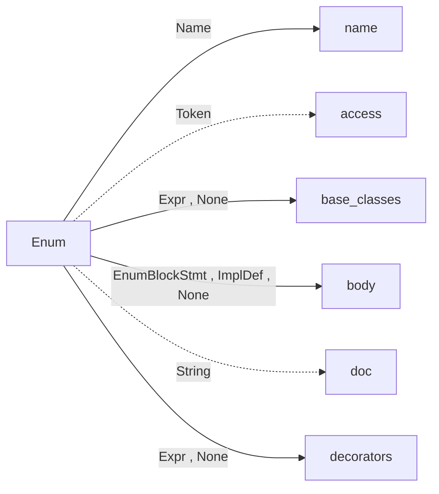
```mermaid
flowchart LR
Enum -->|Name| name
Enum -.->|Token| access
Enum -->|Expr , None| base_classes
Enum -->|EnumBlockStmt , ImplDef , None| body
Enum -.->|String| doc
Enum -->|Expr , None| decorators
```

Enum node type for Jac Ast.

## Name
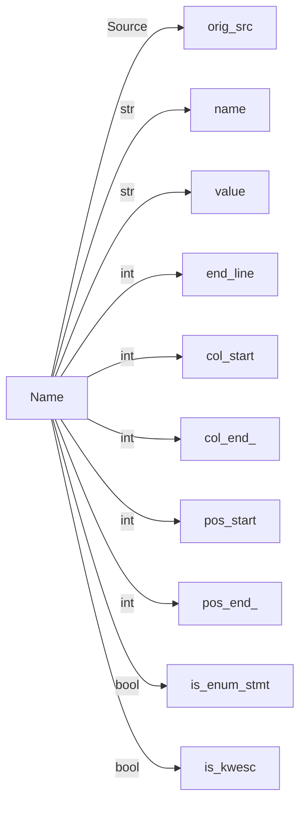
```mermaid
flowchart LR
Name -->|Source| orig_src
Name -->|str| name
Name -->|str| value
Name -->|int| end_line
Name -->|int| col_start
Name -->|int| col_end_
Name -->|int| pos_start
Name -->|int| pos_end_
Name -->|bool| is_enum_stmt
Name -->|bool| is_kwesc
```

Name node type for Jac Ast.

## SubTag
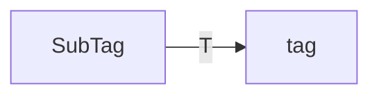
```mermaid
flowchart LR
SubTag -->|T| tag
```

SubTag node type for Jac Ast.

## Module
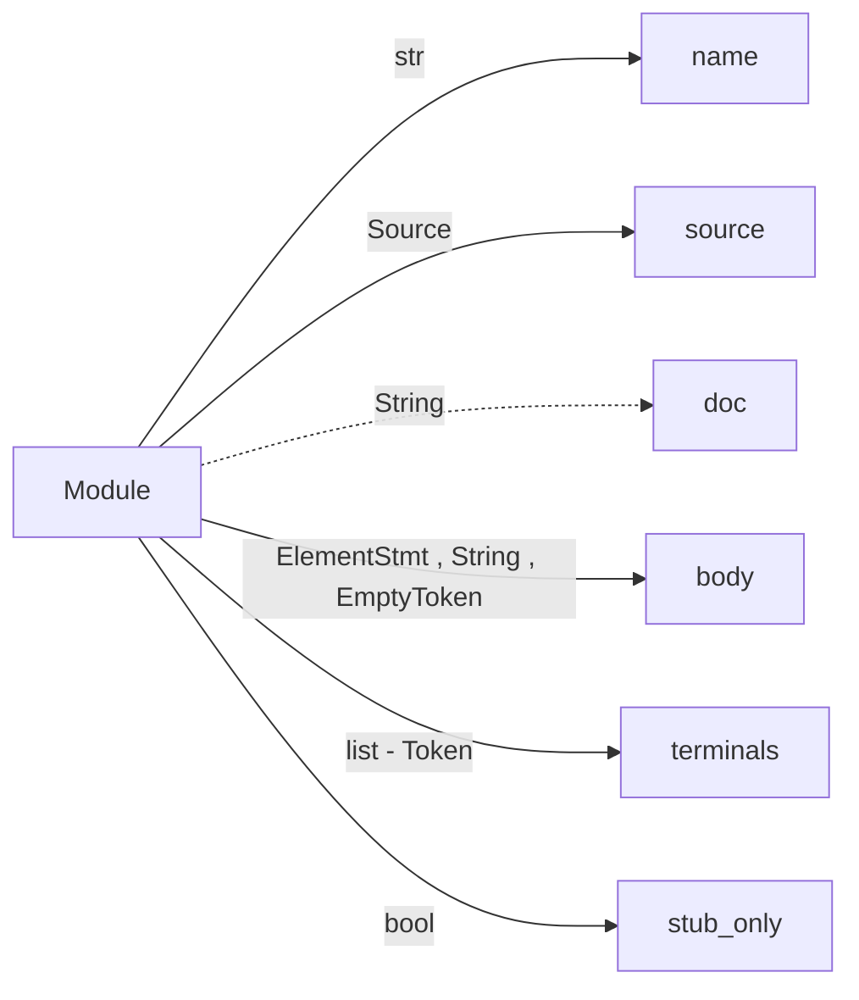
```mermaid
flowchart LR
Module -->|str| name
Module -->|Source| source
Module -.->|String| doc
Module -->|ElementStmt , String , EmptyToken| body
Module -->|list - Token| terminals
Module -->|bool| stub_only
```

Whole Program node type for Jac Ast.

## GlobalVars
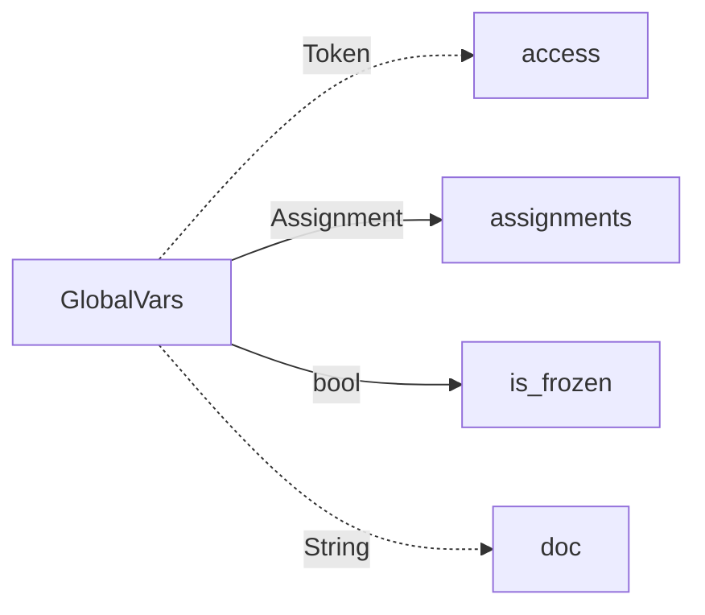
```mermaid
flowchart LR
GlobalVars -.->|Token| access
GlobalVars -->|Assignment| assignments
GlobalVars -->|bool| is_frozen
GlobalVars -.->|String| doc
```

GlobalVars node type for Jac Ast.

## Test
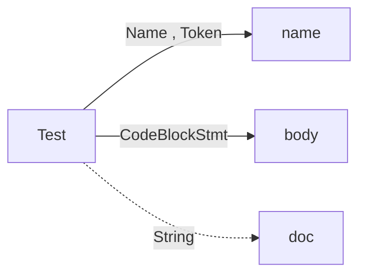
```mermaid
flowchart LR
Test -->|Name , Token| name
Test -->|CodeBlockStmt| body
Test -.->|String| doc
```

Test node type for Jac Ast.

## ModuleCode
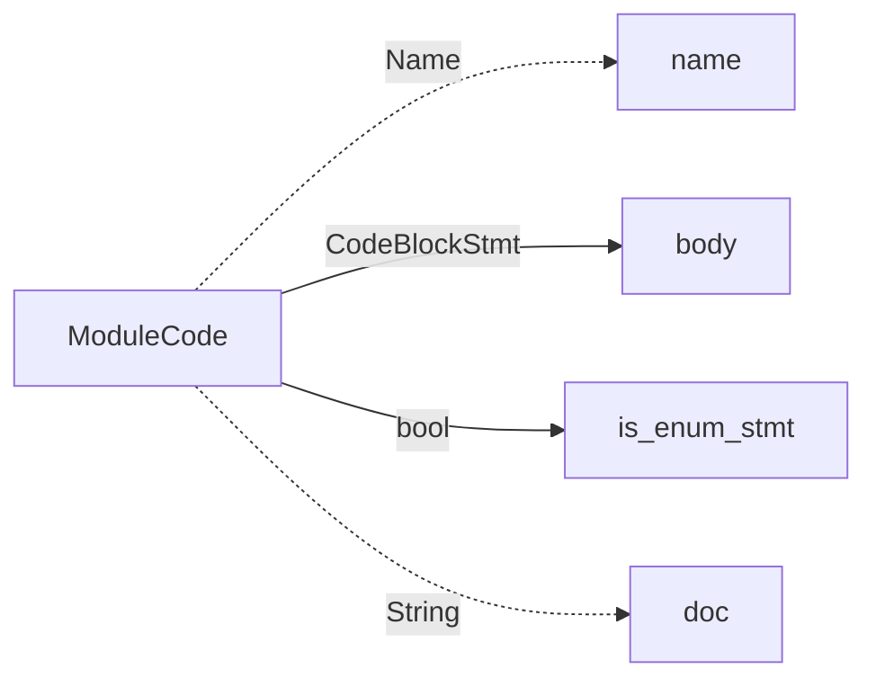
```mermaid
flowchart LR
ModuleCode -.->|Name| name
ModuleCode -->|CodeBlockStmt| body
ModuleCode -->|bool| is_enum_stmt
ModuleCode -.->|String| doc
```

ModuleCode node type for Jac Ast.

## PyInlineCode
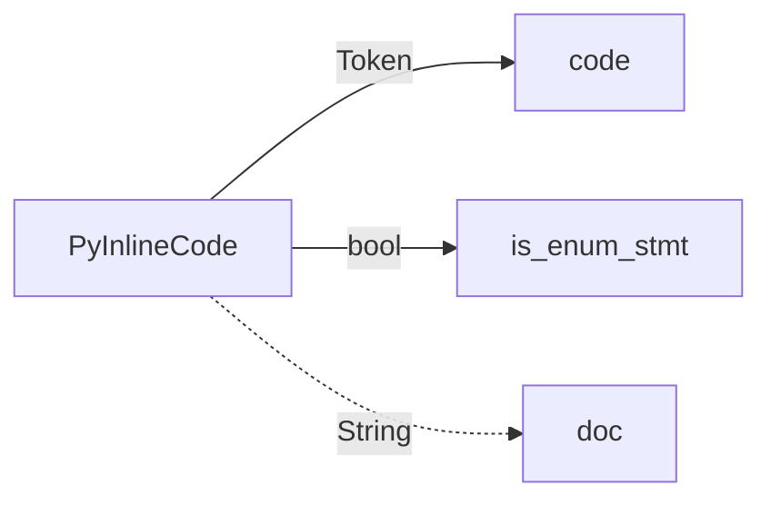
```mermaid
flowchart LR
PyInlineCode -->|Token| code
PyInlineCode -->|bool| is_enum_stmt
PyInlineCode -.->|String| doc
```

PyInlineCode node type for Jac Ast.

## Import
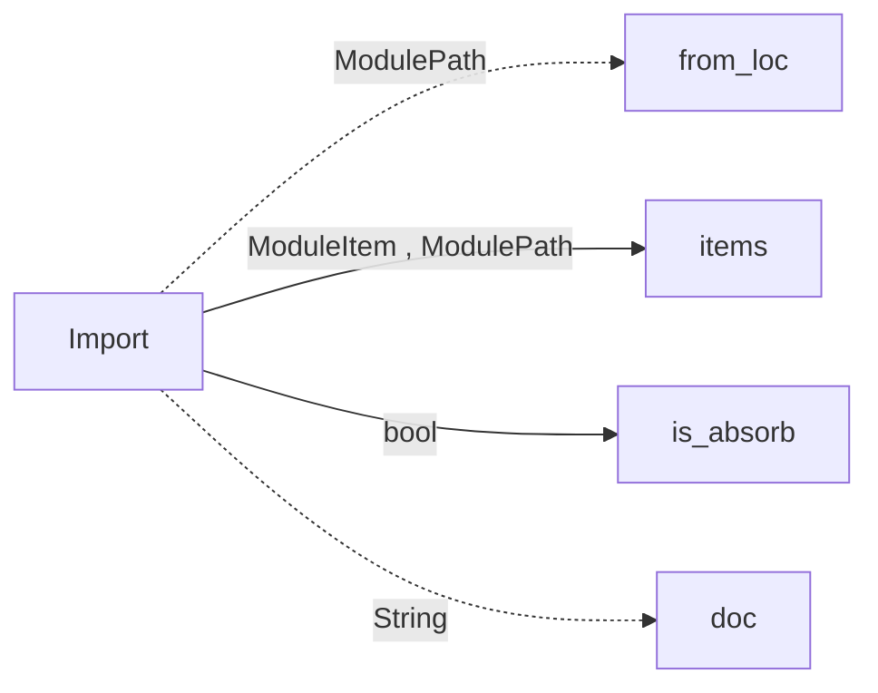
```mermaid
flowchart LR
Import -.->|ModulePath| from_loc
Import -->|ModuleItem , ModulePath| items
Import -->|bool| is_absorb
Import -.->|String| doc
```

Import node type for Jac Ast.

## ModulePath
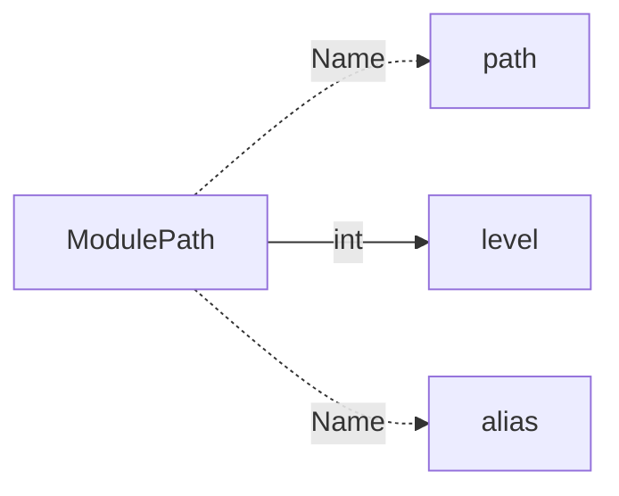
```mermaid
flowchart LR
ModulePath -.->|Name| path
ModulePath -->|int| level
ModulePath -.->|Name| alias
```

ModulePath node type for Jac Ast.

## ModuleItem
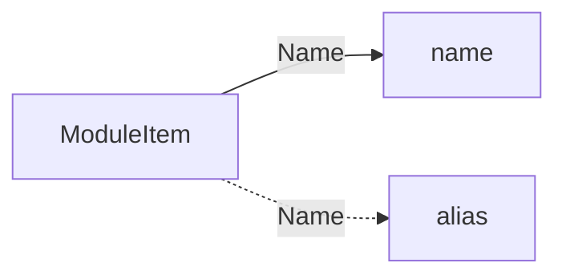
```mermaid
flowchart LR
ModuleItem -->|Name| name
ModuleItem -.->|Name| alias
```

ModuleItem node type for Jac Ast.

## Archetype
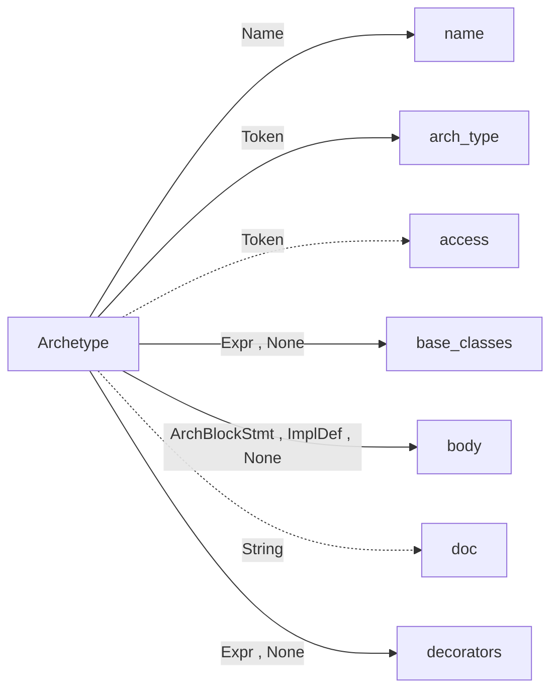
```mermaid
flowchart LR
Archetype -->|Name| name
Archetype -->|Token| arch_type
Archetype -.->|Token| access
Archetype -->|Expr , None| base_classes
Archetype -->|ArchBlockStmt , ImplDef , None| body
Archetype -.->|String| doc
Archetype -->|Expr , None| decorators
```

ObjectArch node type for Jac Ast.

## ImplDef
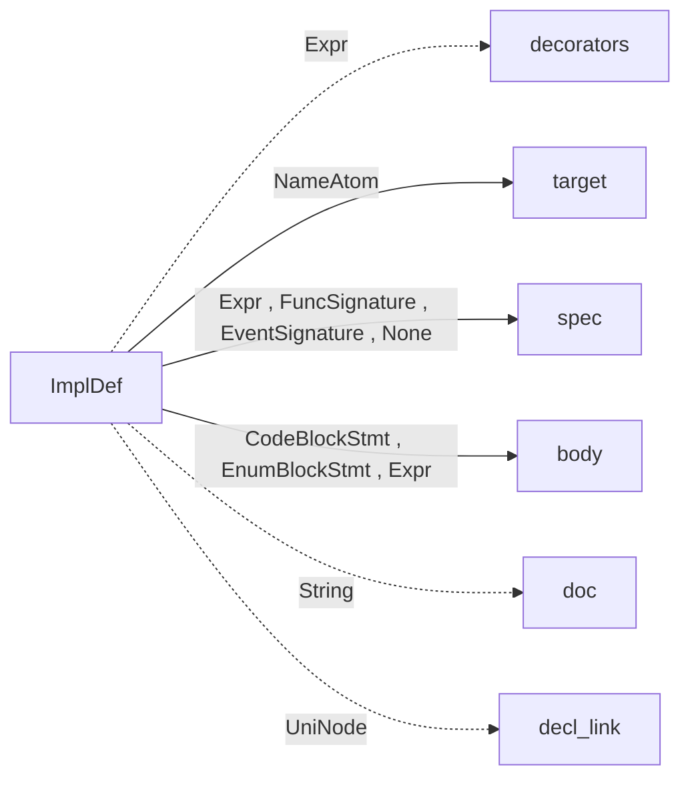
```mermaid
flowchart LR
ImplDef -.->|Expr| decorators
ImplDef -->|NameAtom| target
ImplDef -->|Expr , FuncSignature , EventSignature , None| spec
ImplDef -->|CodeBlockStmt , EnumBlockStmt , Expr| body
ImplDef -.->|String| doc
ImplDef -.->|UniNode| decl_link
```

AstImplOnlyNode node type for Jac Ast.

## SemDef
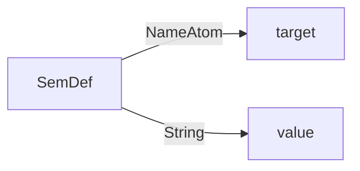
```mermaid
flowchart LR
SemDef -->|NameAtom| target
SemDef -->|String| value
```

SemDef node type for Jac Ast.

## Ability
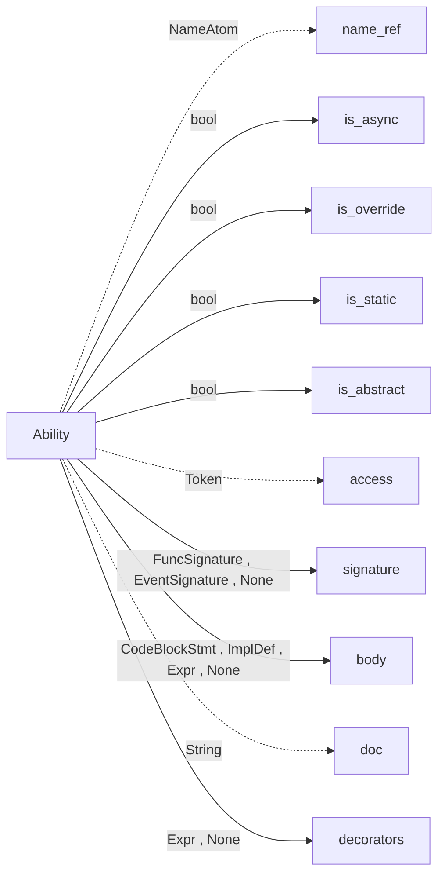
```mermaid
flowchart LR
Ability -.->|NameAtom| name_ref
Ability -->|bool| is_async
Ability -->|bool| is_override
Ability -->|bool| is_static
Ability -->|bool| is_abstract
Ability -.->|Token| access
Ability -->|FuncSignature , EventSignature , None| signature
Ability -->|CodeBlockStmt , ImplDef , Expr , None| body
Ability -.->|String| doc
Ability -->|Expr , None| decorators
```

Ability node type for Jac Ast.

## FuncSignature
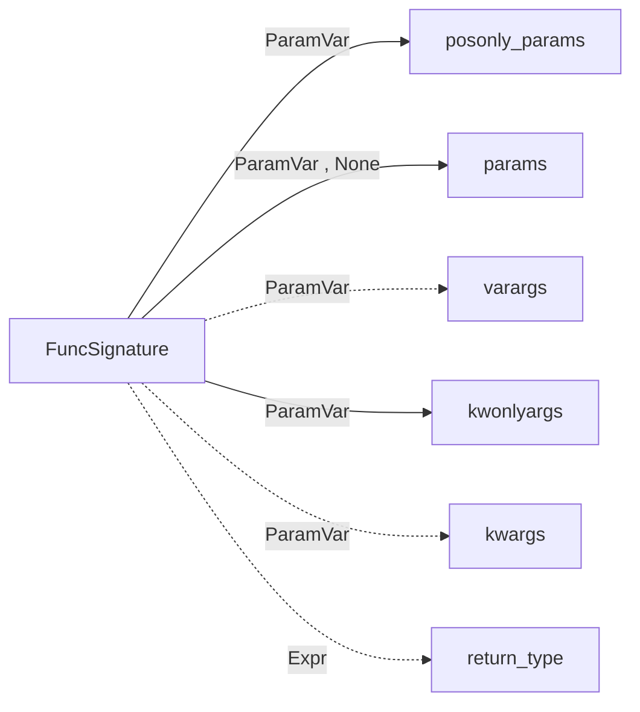
```mermaid
flowchart LR
FuncSignature -->|ParamVar| posonly_params
FuncSignature -->|ParamVar , None| params
FuncSignature -.->|ParamVar| varargs
FuncSignature -->|ParamVar| kwonlyargs
FuncSignature -.->|ParamVar| kwargs
FuncSignature -.->|Expr| return_type
```

FuncSignature node type for Jac Ast.

## EventSignature
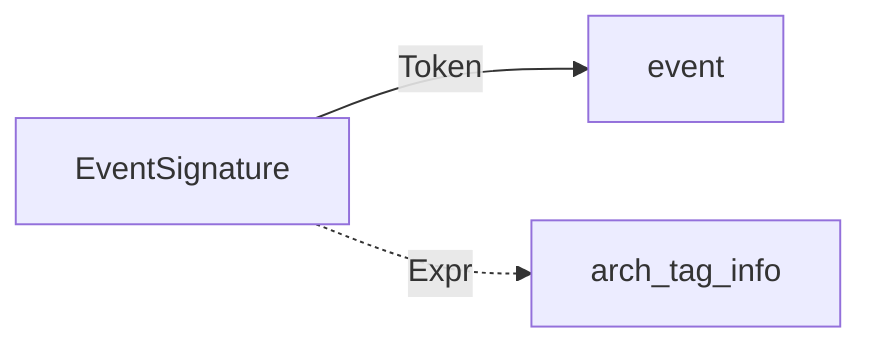
```mermaid
flowchart LR
EventSignature -->|Token| event
EventSignature -.->|Expr| arch_tag_info
```

EventSignature node type for Jac Ast.

## ParamVar
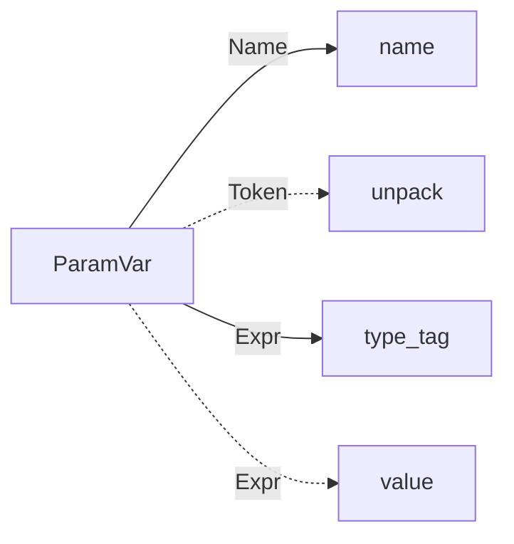
```mermaid
flowchart LR
ParamVar -->|Name| name
ParamVar -.->|Token| unpack
ParamVar -->|Expr| type_tag
ParamVar -.->|Expr| value
```

ParamVar node type for Jac Ast.

## ArchHas
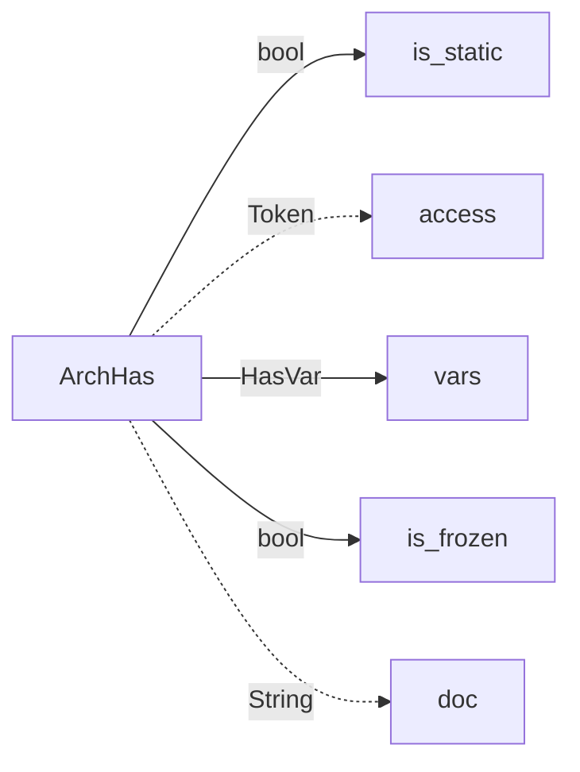
```mermaid
flowchart LR
ArchHas -->|bool| is_static
ArchHas -.->|Token| access
ArchHas -->|HasVar| vars
ArchHas -->|bool| is_frozen
ArchHas -.->|String| doc
```

ArchHas node type for Jac Ast.

## HasVar
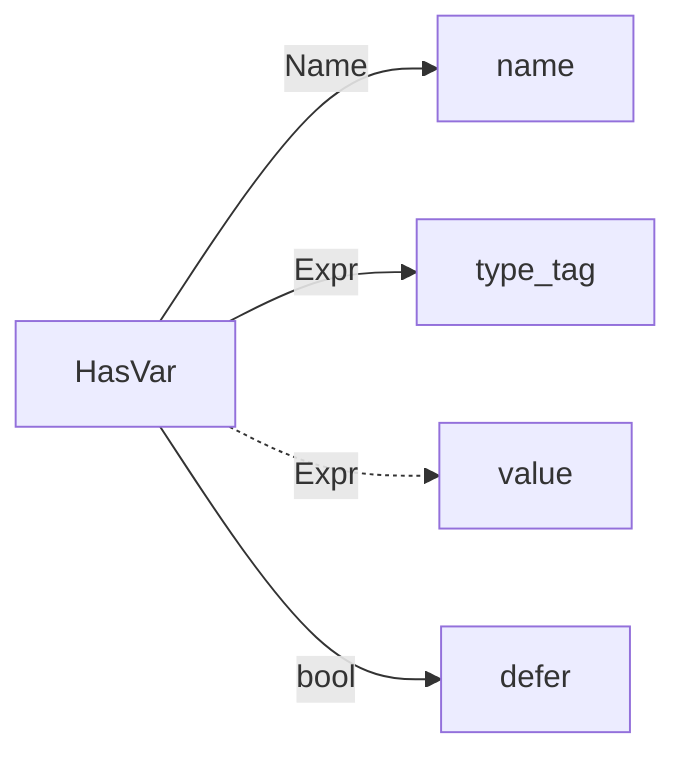
```mermaid
flowchart LR
HasVar -->|Name| name
HasVar -->|Expr| type_tag
HasVar -.->|Expr| value
HasVar -->|bool| defer
```

HasVar node type for Jac Ast.

## TypedCtxBlock
```mermaid
flowchart LR
TypedCtxBlock -->|Expr| type_ctx
TypedCtxBlock -->|CodeBlockStmt| body
```

TypedCtxBlock node type for Jac Ast.

## IfStmt
```mermaid
flowchart LR
IfStmt -->|Expr| condition
IfStmt -->|CodeBlockStmt| body
IfStmt -.->|ElseStmt , ElseIf| else_body
```

IfStmt node type for Jac Ast.

## ElseIf
```mermaid
flowchart LR
ElseIf -->|Expr| condition
ElseIf -->|CodeBlockStmt| body
ElseIf -.->|ElseStmt , ElseIf| else_body
```

ElseIf node type for Jac Ast.

## ElseStmt
```mermaid
flowchart LR
ElseStmt -->|CodeBlockStmt| body
```

ElseStmt node type for Jac Ast.

## ExprStmt
```mermaid
flowchart LR
ExprStmt -->|Expr| expr
ExprStmt -->|bool| in_fstring
```

ExprStmt node type for Jac Ast.

## TryStmt
```mermaid
flowchart LR
TryStmt -->|CodeBlockStmt| body
TryStmt -->|Except| excepts
TryStmt -.->|ElseStmt| else_body
TryStmt -.->|FinallyStmt| finally_body
```

TryStmt node type for Jac Ast.

## Except
```mermaid
flowchart LR
Except -->|Expr| ex_type
Except -.->|Name| name
Except -->|CodeBlockStmt| body
```

Except node type for Jac Ast.

## FinallyStmt
```mermaid
flowchart LR
FinallyStmt -->|CodeBlockStmt| body
```

FinallyStmt node type for Jac Ast.

## IterForStmt
```mermaid
flowchart LR
IterForStmt -->|Assignment| iter
IterForStmt -->|bool| is_async
IterForStmt -->|Expr| condition
IterForStmt -->|Assignment| count_by
IterForStmt -->|CodeBlockStmt| body
IterForStmt -.->|ElseStmt| else_body
```

IterForStmt node type for Jac Ast.

## InForStmt
```mermaid
flowchart LR
InForStmt -->|Expr| target
InForStmt -->|bool| is_async
InForStmt -->|Expr| collection
InForStmt -->|CodeBlockStmt| body
InForStmt -.->|ElseStmt| else_body
```

InForStmt node type for Jac Ast.

## WhileStmt
```mermaid
flowchart LR
WhileStmt -->|Expr| condition
WhileStmt -->|CodeBlockStmt| body
WhileStmt -.->|ElseStmt| else_body
```

WhileStmt node type for Jac Ast.

## WithStmt
```mermaid
flowchart LR
WithStmt -->|bool| is_async
WithStmt -->|ExprAsItem| exprs
WithStmt -->|CodeBlockStmt| body
```

WithStmt node type for Jac Ast.

## ExprAsItem
```mermaid
flowchart LR
ExprAsItem -->|Expr| expr
ExprAsItem -.->|Expr| alias
```

ExprAsItem node type for Jac Ast.

## RaiseStmt
```mermaid
flowchart LR
RaiseStmt -.->|Expr| cause
RaiseStmt -.->|Expr| from_target
```

RaiseStmt node type for Jac Ast.

## AssertStmt
```mermaid
flowchart LR
AssertStmt -->|Expr| condition
AssertStmt -.->|Expr| error_msg
```

AssertStmt node type for Jac Ast.

## CtrlStmt
```mermaid
flowchart LR
CtrlStmt -->|Token| ctrl
```

CtrlStmt node type for Jac Ast.

## DeleteStmt
```mermaid
flowchart LR
DeleteStmt -->|Expr| target
```

DeleteStmt node type for Jac Ast.

## ReportStmt
```mermaid
flowchart LR
ReportStmt -->|Expr| expr
```

ReportStmt node type for Jac Ast.

## ReturnStmt
```mermaid
flowchart LR
ReturnStmt -.->|Expr| expr
```

ReturnStmt node type for Jac Ast.

## VisitStmt
```mermaid
flowchart LR
VisitStmt -.->|Expr| insert_loc
VisitStmt -->|Expr| target
VisitStmt -.->|ElseStmt| else_body
```

VisitStmt node type for Jac Ast.

## AwaitExpr
```mermaid
flowchart LR
AwaitExpr -->|Expr| target
```

AwaitExpr node type for Jac Ast.

## GlobalStmt
```mermaid
flowchart LR
GlobalStmt -->|NameAtom| target
```

GlobalStmt node type for Jac Ast.

## NonLocalStmt
```mermaid
flowchart LR
NonLocalStmt -->|NameAtom| target
```

NonLocalStmt node type for Jac Ast.

## Assignment
```mermaid
flowchart LR
Assignment -->|Expr| target
Assignment -.->|Expr , YieldExpr| value
Assignment -.->|Expr| type_tag
Assignment -->|bool| mutable
Assignment -.->|Token| aug_op
Assignment -->|bool| is_enum_stmt
```

Assignment node type for Jac Ast.

## ConcurrentExpr
```mermaid
flowchart LR
ConcurrentExpr -.->|Token| tok
ConcurrentExpr -->|Expr| target
```

ConcurrentExpr node type for Jac Ast.

## BinaryExpr
```mermaid
flowchart LR
BinaryExpr -->|Expr| left
BinaryExpr -->|Expr| right
BinaryExpr -->|Token , DisconnectOp , ConnectOp| op
```

BinaryExpr node type for Jac Ast.

## CompareExpr
```mermaid
flowchart LR
CompareExpr -->|Expr| left
CompareExpr -->|list - Expr| rights
CompareExpr -->|list - Token| ops
```

CompareExpr node type for Jac Ast.

## Bool
```mermaid
flowchart LR
Bool -->|Source| orig_src
Bool -->|str| name
Bool -->|str| value
Bool -->|int| end_line
Bool -->|int| col_start
Bool -->|int| col_end_
Bool -->|int| pos_start
Bool -->|int| pos_end_
```

Bool node type for Jac Ast.

## BoolExpr
```mermaid
flowchart LR
BoolExpr -->|Token| op
BoolExpr -->|list - Expr| values
```

BoolExpr node type for Jac Ast.

## LambdaExpr
```mermaid
flowchart LR
LambdaExpr -->|Expr, CodeBlockStmt| body
LambdaExpr -.->|FuncSignature| signature
```

LambdaExpr node type for Jac Ast.

## UnaryExpr
```mermaid
flowchart LR
UnaryExpr -->|Expr| operand
UnaryExpr -->|Token| op
```

UnaryExpr node type for Jac Ast.

## IfElseExpr
```mermaid
flowchart LR
IfElseExpr -->|Expr| condition
IfElseExpr -->|Expr| value
IfElseExpr -->|Expr| else_value
```

IfElseExpr node type for Jac Ast.

## MultiString
```mermaid
flowchart LR
MultiString -->|String , FString| strings
```

MultiString node type for Jac Ast.

## FString
```mermaid
flowchart LR
FString -.->|Token| start
FString -->|String , FormattedValue| parts
FString -.->|Token| end
```

FString node type for Jac Ast.

## FormattedValue
```mermaid
flowchart LR
FormattedValue -->|Expr| format_part
FormattedValue -->|int| conversion
FormattedValue -->|Expr , None| format_spec
```

FormattedValue node type for Jac Ast.

## ListVal
```mermaid
flowchart LR
ListVal -->|Expr| values
```

ListVal node type for Jac Ast.

## SetVal
```mermaid
flowchart LR
SetVal -->|Expr , None| values
```

SetVal node type for Jac Ast.

## TupleVal
```mermaid
flowchart LR
TupleVal -->|Expr , KWPair| values
```

TupleVal node type for Jac Ast.

## DictVal
```mermaid
flowchart LR
DictVal -->|KVPair| kv_pairs
```

DictVal node type for Jac Ast.

## KVPair
```mermaid
flowchart LR
KVPair -.->|Expr| key
KVPair -->|Expr| value
```

KVPair node type for Jac Ast.

## KWPair
```mermaid
flowchart LR
KWPair -.->|NameAtom| key
KWPair -->|Expr| value
```

KWPair node type for Jac Ast.

## InnerCompr
```mermaid
flowchart LR
InnerCompr -->|bool| is_async
InnerCompr -->|Expr| target
InnerCompr -->|Expr| collection
InnerCompr -.->|list - Expr| conditional
```

InnerCompr node type for Jac Ast.

## ListCompr
```mermaid
flowchart LR
ListCompr -->|Expr| out_expr
ListCompr -->|list - InnerCompr| compr
```

ListCompr node type for Jac Ast.

## GenCompr
```mermaid
flowchart LR
GenCompr -->|Expr| out_expr
GenCompr -->|list - InnerCompr| compr
```

GenCompr node type for Jac Ast.

## SetCompr
```mermaid
flowchart LR
SetCompr -->|Expr| out_expr
SetCompr -->|list - InnerCompr| compr
```

SetCompr node type for Jac Ast.

## DictCompr
```mermaid
flowchart LR
DictCompr -->|KVPair| kv_pair
DictCompr -->|list - InnerCompr| compr
```

DictCompr node type for Jac Ast.

## AtomTrailer
```mermaid
flowchart LR
AtomTrailer -->|Expr| target
AtomTrailer -->|AtomExpr , Expr| right
AtomTrailer -->|bool| is_attr
AtomTrailer -->|bool| is_null_ok
AtomTrailer -->|bool| is_genai
```

AtomTrailer node type for Jac Ast.

## AtomUnit
```mermaid
flowchart LR
AtomUnit -->|Expr , YieldExpr , Ability| value
```

AtomUnit node type for Jac Ast.

## YieldExpr
```mermaid
flowchart LR
YieldExpr -.->|Expr| expr
YieldExpr -->|bool| with_from
```

YieldExpr node type for Jac Ast.

## FuncCall
```mermaid
flowchart LR
FuncCall -->|Expr| target
FuncCall -->|Expr , KWPair , None| params
FuncCall -.->|Expr| genai_call
```

FuncCall node type for Jac Ast.

## IndexSlice
```mermaid
flowchart LR
IndexSlice -->|list - Slice| slices
IndexSlice -->|bool| is_range
```

IndexSlice node type for Jac Ast.

## TypeRef
```mermaid
flowchart LR
TypeRef -->|NameAtom| target
```

ArchRef node type for Jac Ast.

## EdgeRefTrailer
```mermaid
flowchart LR
EdgeRefTrailer -->|list - Expr , FilterCompr| chain
EdgeRefTrailer -->|bool| edges_only
EdgeRefTrailer -->|bool| is_async
```

EdgeRefTrailer node type for Jac Ast.

## EdgeOpRef
```mermaid
flowchart LR
EdgeOpRef -.->|FilterCompr| filter_cond
EdgeOpRef -->|EdgeDir| edge_dir
```

EdgeOpRef node type for Jac Ast.

## DisconnectOp
```mermaid
flowchart LR
DisconnectOp -->|EdgeOpRef| edge_spec
```

DisconnectOp node type for Jac Ast.

## ConnectOp
```mermaid
flowchart LR
ConnectOp -.->|Expr| conn_type
ConnectOp -.->|AssignCompr| conn_assign
ConnectOp -->|EdgeDir| edge_dir
```

ConnectOpRef node type for Jac Ast.

## FilterCompr
```mermaid
flowchart LR
FilterCompr -.->|Expr| f_type
FilterCompr -->|CompareExpr| compares
```

FilterCompr node type for Jac Ast.

## AssignCompr
```mermaid
flowchart LR
AssignCompr -->|KWPair| assigns
```

AssignCompr node type for Jac Ast.

## JsxElement
```mermaid
flowchart LR
JsxElement -.->|'JsxElementName'| name
JsxElement -.->|'JsxAttribute'| attributes
JsxElement -.->|'JsxChild'


## From: quickstart.md

Jac is a drop-in replacement for Python and supersets Python, much like Typescript supersets Javascript or C++ supersets C. It extends Python's semantics while maintaining full interoperability with the Python ecosystem.
Anything you can build with Python, you can build in Jac, and often more efficiently.

```jac
import time at t;

def example(){
    number = 1+2;
    print(f"Calculated {number}");
    t.sleep(2);
    if number < 4 {
        print("Small number");
    }
}

# jac's equivalent of main
with entry {
    print("Hello world!");
    example();
}
```
```jac
node Person {
    has name: str;
    has age: int;

    def greet -> str {
        return f"Hello, I'm {self.name}!";
    }

    def celebrate_birthday {
        self.age += 1;
        print(f"{self.name} is now {self.age}!");
    }
}

with entry {
    alice = Person(name="Alice", age=25);
    bob = Person(name="Bob", age=30);
    print(alice.greet());  # Standard method call
}
```
```jac
node Person { has name: str; }

edge Friend {
    has since: int;
    has strength: int = 5;

    def is_strong -> bool {
        return self.strength >= 7;
    }
}

with entry {
    alice +>:Friend(since=2015, strength=9):+> bob;

    # Query all Friend relationships from alice
    friends = [alice ->:Friend:->];
    print(f"Alice has {len(friends)} friend(s)");

    # The result is a list of Person nodes, not data structures you have to unpack
}
```
```jac
node Entity {
    has id: str;
    has created: str;
}

node Person(Entity) {
    has email: str;
    def notify(msg: str) {
        print(f"To {self.email}: {msg}");
    }
}

# Person inherits from Entity, gets id/created fields
# plus its own email field and notify method
```
```jac
walker Greeter {
    has greeting_count: int = 0;

    can start with `root entry {
        print("Starting journey!");
        visit [-->];  # Begin traversal from root's outgoing edges
    }

    can greet with Person entry {
        print(f"Hello, {here.name}!");  # 'here' is current node
        self.greeting_count += 1;
        visit [-->];  # Continue to next node's connections
    }
}

with entry {
    alice = Person(name="Alice");
    bob = Person(name="Bob");

    root ++> alice ++> bob;
    root spawn Greeter();  # Launch walker, it navigates autonomously
}
```
```jac
walker DataCollector {
    has counter: int = 0;          # Walker state, persists across visits
    has visited_names: list = [];  # Accumulates data during traversal

    can collect with NodeType entry {  # Executes when visiting NodeType
        self.visited_names.append(here.name);
        self.counter += 1;
        visit [-->];  # Default: depth-first traversal
    }
}
```
```jac
walker Tourist {
    can meet_person with Person entry {
        print(f"Met {here.name}, age {here.age}");
        visit [-->];
    }

    can visit_city with City entry {
        print(f"Visiting {here.name}, pop {here.population}");
        visit [-->];
    }
}
```
```jac
node Person {
    has name: str;

    can receive_greeting with Greeter entry {
        print(f"{self.name} acknowledges greeting");
    }
}
```
```jac
node Person {
    can greet_visitor with Visitor entry {
        print(f"{self.name} says: Welcome!");  # Executes first
    }
}

walker Visitor {
    can meet_person with Person entry {
        print(f"Visitor says: Hello, {here.name}!");  # Executes second
        visit [-->];
    }
}
```
```jac
walker AgeCollector {
    has ages: list = [];

    can collect with Person entry {
        self.ages.append(here.age);  # Accumulate in walker state
        visit [-->];
    }
}

# After execution: walker.ages contains [25, 30, 28]
```
```jac
node Task {
    has title: str;
    has status: str = "pending";
}

edge DependsOn {}

walker TaskAnalyzer {
    has ready_tasks: list = [];

    can analyze with Task entry {
        if here.status != "pending": return;

        # Get all dependencies
        deps = [here ->:DependsOn:->];

        # Check if all complete
        all_done = all(dep.status == "complete" for dep in deps);

        if all_done {
            self.ready_tasks.append(here.title);
        }

        visit [-->];  # Continue to next task
    }
}

# Usage: spawn analyzer, then check analyzer.ready_tasks
```


## From: chapter_16.md

# Chapter 17: Type System Deep Dive

In this chapter, we'll explore Jac's advanced type system that provides powerful generic programming capabilities, type constraints, and graph-aware type checking. We'll build a generic data processing system that demonstrates type safety, constraints, and runtime validation through practical examples.

What You'll Learn
- Advanced generic programming with the `any` type
- Type constraints and validation patterns
- Graph-aware type checking for nodes and edges
- Building type-safe, reusable components
- Runtime type validation and guards

Advanced Type System Features

Jac's type system goes beyond basic types to provide powerful features that work seamlessly with Object-Spatial Programming. The `any` type enables flexible programming while maintaining type safety through runtime validation.

Type System Benefits
- Flexible Typing: Use `any` for maximum flexibility when needed
- Runtime Safety: Validate types at runtime with built-in guards
- Graph Integration: Type safety extends to nodes, edges, and walkers
- Constraint Validation: Enforce business rules through type checking

Traditional vs Jac Type System

Type System Comparison
Traditional Approach
```python
# python_generics.py - Complex generic setup
from typing import TypeVar, Generic, List, Any, Union, Optional
from abc import ABC, abstractmethod

T = TypeVar('T')
U = TypeVar('U')

class Processable(ABC):
    @abstractmethod
    def process(self) -> str:
        pass

class DataProcessor(Generic[T]):
    def __init__(self):
        self.items: List[T] = []

    def add(self, item: T) -> None:
        self.items.append(item)

    def process_all(self, func) -> List[Any]:
        return [func(item) for item in self.items]

    def find(self, predicate) -> Optional[T]:
        for item in self.items:
            if predicate(item):
                return item
        return None

# Usage requires explicit type parameters
processor: DataProcessor[int] = DataProcessor()
processor.add(42)
processor.add(24)
```
Jac Type System
```jac
# data_processor.jac - Simple and flexible
obj DataProcessor {
    has items: list[any] = [];

    def add(item: any) -> None {
        self.items.append(item);
    }

    def process_all(func: any) -> list[any] {
        return [func(item) for item in self.items];
    }

    def find(predicate: any) -> any | None {
        for item in self.items {
            if predicate(item) {
                return item;
            }
        }
        return None;
    }

    def filter_by_type(target_type: any) -> list[any] {
        return [item for item in self.items if isinstance(item, target_type)];
    }
}

with entry {
    # Simple usage with type inference
    processor = DataProcessor();
    processor.add(42);
    processor.add("hello");
    processor.add(3.14);

    # Type-safe operations with runtime validation
    numbers = processor.filter_by_type(int);
    print(f"Numbers: {numbers}");
}
```

Runtime Type Validation

Jac provides powerful runtime type checking capabilities that complement the flexible `any` type, enabling robust error handling and dynamic type validation.

Type Guards and Validation

Runtime Type Validation System
```jac
# type_validator.jac
obj TypeValidator {
    has strict_mode: bool = False;

    """Check if value matches expected type."""
    def validate_type(value: any, expected_type: any) -> bool {
        if expected_type == int {
            return isinstance(value, int);
        } elif expected_type == str {
            return isinstance(value, str);
        } elif expected_type == float {
            return isinstance(value, float);
        } elif expected_type == list {
            return isinstance(value, list);
        } elif expected_type == dict {
            return isinstance(value, dict);
        }
        return True;  # Allow any for unknown types
    }

    """Safely cast value to target type."""
    def safe_cast(value: any, target_type: any) -> any | None {
        try {
            if target_type == int {
                return int(value);
            } elif target_type == str {
                return str(value);
            } elif target_type == float {
                return float(value);
            } elif target_type == bool {
                return bool(value);
            }
            return value;
        } except ValueError {
            if self.strict_mode {
                raise ValueError(f"Cannot cast {value} to {target_type}");
            }
            return None;
        }
    }

    """Validate value is within specified range."""
    def validate_range(value: any, min_val: any = None, max_val: any = None) -> bool {
        if min_val is not None and value < min_val {
            return False;
        }
        if max_val is not None and value > max_val {
            return False;
        }
        return True;
    }
}

with entry {
    validator = TypeValidator(strict_mode=True);

    # Test type validation
    test_values = [42, "hello", 3.14, True, [1, 2, 3]];
    expected_types = [int, str, float, bool, list];

    for i in range(len(test_values)) {
        value = test_values[i];
        expected = expected_types[i];
        is_valid = validator.validate_type(value, expected);
        print(f"{value} is {expected}: {is_valid}");
    }

    # Test safe casting
    cast_result = validator.safe_cast("123", int);
    print(f"Cast '123' to int: {cast_result}");

    # Test range validation
    in_range = validator.validate_range(50, 0, 100);
    print(f"50 in range [0, 100]: {in_range}");
}
```
Advanced Type Guards

Complex Type Validation Patterns
```jac
# advanced_validator.jac
obj SchemaValidator {
    has schema: dict[str, any] = {};

    """Define expected type for a field."""
    def set_field_type(field_name: str, field_type: any) -> None {
        self.schema[field_name] = field_type;
    }

    """Validate object against schema."""
    def validate_object(obj: any) -> dict[str, any] {
        results = {
            "valid": True,
            "errors": [],
            "field_results": {}
        };

        if not isinstance(obj, dict) {
            results["valid"] = False;
            results["errors"].append("Object must be a dictionary");
            return results;
        }

        for (field_name, expected_type) in self.schema.items() {
            if field_name not in obj {
                results["valid"] = False;
                results["errors"].append(f"Missing required field: {field_name}");
                results["field_results"][field_name] = False;
            } else {
                field_value = obj[field_name];
                is_valid = self.validate_field(field_value, expected_type);
                results["field_results"][field_name] = is_valid;
                if not is_valid {
                    results["valid"] = False;
                    results["errors"].append(f"Invalid type for {field_name}: expected {expected_type}, got {type(field_value)}");
                }
            }
        }

        return results;
    }

    """Validate individual field value."""
    def validate_field(value: any, expected_type: any) -> bool {
        if expected_type == "string" {
            return isinstance(value, str);
        } elif expected_type == "number" {
            return isinstance(value, (int, float));
        } elif expected_type == "boolean" {
            return isinstance(value, bool);
        } elif expected_type == "list" {
            return isinstance(value, list);
        } elif expected_type == "dict" {
            return isinstance(value, dict);
        }
        return True;
    }
}

with entry {
    # Create schema for user data
    user_validator = SchemaValidator();
    user_validator.set_field_type("name", "string");
    user_validator.set_field_type("age", "number");
    user_validator.set_field_type("email", "string");
    user_validator.set_field_type("active", "boolean");

    # Test valid user
    valid_user = {
        "name": "Alice",
        "age": 30,
        "email": "alice@example.com",
        "active": True
    };

    result = user_validator.validate_object(valid_user);
    print(f"Valid user validation: {result}");

    # Test invalid user
    invalid_user = {
        "name": "Bob",
        "age": "thirty",  # Wrong type
        "email": "bob@example.com"
        # Missing 'active' field
    };

    result = user_validator.validate_object(invalid_user);
    print(f"Invalid user validation: {result}");
}
```

Graph-Aware Type Checking

Jac's type system extends to Object-Spatial Programming constructs, providing compile-time and runtime guarantees about graph structure and walker behavior.

Node and Edge Type Safety

Type-Safe Graph Operations
```jac
# typed_graph.jac
node Person {
    has name: str;
    has age: int;

    def validate_person() -> bool {
        return len(self.name) > 0 and self.age >= 0;
    }
}

node Company {
    has company_name: str;
    has industry: str;

    def validate_company() -> bool {
        return len(self.company_name) > 0 and len(self.industry) > 0;
    }
}

edge WorksAt {
    has position: str;
    has salary: float;
    has start_date: str;

    def validate_employment() -> bool {
        return len(self.position) > 0 and self.salary > 0;
    }
}

edge FriendsWith {
    has since: str;
    has closeness: int;  # 1-10 scale

    def validate_friendship() -> bool {
        return self.closeness >= 1 and self.closeness <= 10;
    }
}

obj GraphValidator {
    has validation_errors: list[str] = [];

    """Validate any node type."""
    def validate_node(node: any) -> bool {
        self.validation_errors = [];

        if isinstance(node, Person) {
            if not node.validate_person() {
                self.validation_errors.append(f"Invalid person: {node.name}");
                return False;
            }
        } elif isinstance(node, Company) {
            if not node.validate_company() {
                self.validation_errors.append(f"Invalid company: {node.company_name}");
                return False;
            }
        } else {
            self.validation_errors.append(f"Unknown node type: {type(node)}");
            return False;
        }

        return True;
    }

    """Validate edge connection between nodes."""
    def validate_edge_connection(from_node: any, edge: any, to_node: any) -> bool {
        # Check if edge type is appropriate for node types
        if isinstance(edge, WorksAt) {
            # Person should work at Company
            if not (isinstance(from_node, Person) and isinstance(to_node, Company)) {
                self.validation_errors.append("WorksAt edge must connect Person to Company");
                return False;
            }
            return edge.validate_employment();
        } elif isinstance(edge, FriendsWith) {
            # Both nodes should be Person
            if not (isinstance(from_node, Person) and isinstance(to_node, Person)) {
                self.validation_errors.append("FriendsWith edge must connect Person to Person");
                return False;
            }
            return edge.validate_friendship();
        }

        self.validation_errors.append(f"Unknown edge type: {type(edge)}");
        return False;
    }
}

with entry {
    # Create graph elements
    alice = Person(name="Alice", age=30);
    bob = Person(name="Bob", age=25);
    tech_corp = Company(company_name="TechCorp", industry="Technology");

    # Create relationships
    works_edge = WorksAt(position="Developer", salary=75000.0, start_date="2023-01-15");
    friend_edge = FriendsWith(since="2020-01-01", closeness=8);

    # Validate graph elements
    validator = GraphValidator();

    # Validate nodes
    alice_valid = validator.validate_node(alice);
    print(f"Alice valid: {alice_valid}");

    # Validate edge connections
    work_connection_valid = validator.validate_edge_connection(alice, works_edge, tech_corp);
    print(f"Work connection valid: {work_connection_valid}");

    friend_connection_valid = validator.validate_edge_connection(alice, friend_edge, bob);
    print(f"Friend connection valid: {friend_connection_valid}");

    # Test invalid connection
    invalid_connection = validator.validate_edge_connection(alice, works_edge, bob);  # Wrong types
    print(f"Invalid connection valid: {invalid_connection}");
    print(f"Validation errors: {validator.validation_errors}");
}
```
Walker Type Validation

Type-Safe Walker Patterns
```jac
# typed_walkers.jac

node Person {
    has name: str;
    has age: int;

    def validate_person() -> bool {
        return len(self.name) > 0 and self.age >= 0;
    }
}

node Company {
    has company_name: str;
    has industry: str;

    def validate_company() -> bool {
        return len(self.company_name) > 0 and len(self.industry) > 0;
    }
}

edge WorksAt {
    has position: str;
    has salary: float;
    has start_date: str;

    def validate_employment() -> bool {
        return len(self.position) > 0 and self.salary > 0;
    }
}

edge FriendsWith {
    has since: str;
    has closeness: int;  # 1-10 scale

    def validate_friendship() -> bool {
        return self.closeness >= 1 and self.closeness <= 10;
    }
}

walker PersonVisitor {
    has visited_count: int = 0;
    has person_names: list[str] = [];
    has validation_errors: list[str] = [];

    can visit_person with Person entry {
        # Type-safe person processing
        if self.validate_person_node(here) {
            self.visited_count += 1;
            self.person_names.append(here.name);
            print(f"Visited person: {here.name} (age {here.age})");

            # Continue to connected persons
            friends = [->:FriendsWith:->(`?Person)];
            if friends {
                visit friends;
            }
        } else {
            print(f"Invalid person node encountered: {here.name}");
        }
    }

    can visit_company with Company entry {
        # Companies are not processed by PersonVisitor
        print(f"Skipping company: {here.company_name}");
    }

    """Validate person node before processing."""
    def validate_person_node(person: any) -> bool {
        if not isinstance(person, Person) {
            self.validation_errors.append(f"Expected Person, got {type(person)}");
            return False;
        }

        if not person.validate_person() {
            self.validation_errors.append(f"Invalid person data: {person.name}");
            return False;
        }

        return True;
    }
}

walker CompanyAnalyzer {
    has companies_visited: list[str] = [];
    has total_employees: int = 0;

    can analyze_company with Company entry {
        if self.validate_company_node(here) {
            self.companies_visited.append(here.company_name);
            print(f"Analyzing company: {here.company_name} in {here.industry}");

            # Count employees (people working at this company)
            employees = [<-:WorksAt:<-(`?Person)];
            employee_count = len(employees);
            self.total_employees += employee_count;

            print(f"  Employees: {employee_count}");
            for employee in employees {
                print(f"    - {employee.name}");
            }
        }
    }


## From: chapter_6.md

```jac
obj ConfigReader {
    has config_file: str;
    has config_data: dict[str, any] = {};

    def load_config() -> bool;
    def get_value(key: str, default: any = None) -> any;
    def set_value(key: str, value: any) -> None;
    def save_config() -> bool;
    def create_default_config() -> None;
}
```
```jac
obj Application {
    has config: ConfigReader;
    has logger: any;

    def start() -> None;
    def setup_logging() -> None;
    def get_database_config() -> dict[str, any];
    def run_debug_mode() -> None;
    def run_normal_mode() -> None;
}
```


## From: chapter_1.md

```jac
node Person {
    has name: str;
}

edge FriendsWith;
```
```jac
node User {
    has username: str;
    has email: str;
    has created_at: str;
}

node Post {
    has title: str;
    has content: str;
    has likes: int = 0;
}
```
```jac
node Person {
    has name: str;
    has age: int;
}

edge FamilyRelation {
    # Edges can also have properties
    has relationship_type: str;
}
```
```jac
node Person {
    has name: str;
    has visited: bool = False;  # To keep track of who we've greeted
}

edge FriendsWith;
```
```jac
node Counter {
    has count: int = 0;

    def increment() -> None;
}
```
```jac
node UserProfile {
    has username: str;
    has bio: str = "";
}
```
```jac
# Variables and functions work similarly
def calculate_average(numbers: list[float]) -> float {
    if len(numbers) == 0 {
        return 0.0;
    }
    return sum(numbers) / len(numbers);
}
```
| Aspect | Python | Jac |
|--------|--------|-----|
| **Type System** | Optional hints | Mandatory annotations |
```jac
node Person {
    has name: str;
    has age: int;
    has interests: list[str] = [];
}

edge FriendsWith {
    has since: str;
    has closeness: int;  # 1-10 scale
}
```
```jac
walker FindCommonInterests {
    # The walker needs to know who we're comparing against.
    has target_person: Person;
    # It will store the results of its search here.
    has common_interests: list[str] = [];
```
```jac
node Person {
    has name: str;
    has age: int;
    has interests: list[str] = [];
}

edge FriendsWith {
    has since: str;
    has closeness: int;  # 1-10 scale
}

walker FindCommonInterests {
    has target_person: Person;
    has common_interests: list[str] = [];
```


## From: chapter_2.md

**Variables** how you store and manage data in your program. Each variable has a **type**, which tells Jac what kind of information it can hold, like numbers or text.

Jac requires you to declare the type for every variable you create. This is known as **strong typing**. Unlike in Python, where type hints are optional, Jac makes them mandatory. This helps you catch common errors such as runtime type errors early and makes your code easier to read and maintain, especially as your projects grow.

### Variable Declarations
To declare a variable in Jac, you specify its name, its type, and its initial value.

```jac
with entry {
    # Basic type annotations (Jac requires you to specify the type for each variable.)
    student_name: str = "Alice";
    grade: int = 95;
    gpa: float = 3.8;
    is_honor_student: bool = True;
}
```

A **literal** is a fixed value you write directly in your code, like "Alice" or 95. Jac uses common literals like *string*, *integer*, *float*, and *boolean*. It also introduces a special kind of literal called an **architype** (node, edge, and walker), which was briefly discussed in the prvious chapter.We will explore architypes in more detail later in chapter 9.

### Integers
An integer is a whole number (without a decimal point). In Jac, you declare integers using the `int` type.

```jac
with entry {
    student_id: int = 12345;
    print(student_id);
}
```

### Floats
A float is a number with a decimal point. You declare floats using the `float` type.
```jac
with entry {
    gpa: float = 3.85;
    print(gpa);
}
```

### Strings
A string is a sequence of characters, like a name or a sentence. Strings are declared with the `str` type and are enclosed in quotes.

```jac
with entry {
    student_name: str = "Alice Johnson";
    # You can use f-strings to easily include variables in your output.
    print(f"Student Name: {student_name}");
}
```

### Booleans
A boolean represents a truth value: either True` or `False`. You declare booleans using the `bool` type.

```jac
with entry {
    is_enrolled: bool = True;
    print(f"Is enrolled: {is_enrolled}");
}
```

### Any Type for Flexibility
Sometimes, you may need a variable that can hold values of different types. For these situations, Jac provides the `any` type similar to Python's dynamic typing.

```jac
with entry {
    # This variable can hold different kinds of data.
    grade_data: any = 95;
    print(f"Grade as number: {grade_data}");

    # Now, we can assign a string to the same variable.
    grade_data = "A";  # Now a letter grade
    print(f"Grade as letter: {grade_data}");
}
```


## From: chapter_10.md

```jac
            has visited_locations: list[str] = [];
```
```jac
            has messages: list[str] = [];
```
```jac
            has rooms_visited: set[str] = {};
```
```jac
            has present_students: list[str] = [];
            has absent_students: list[str] = [];
```


## From: chapter_11.md

```jac
node Person {
    has name: str;
    has age: int;
    has city: str;
}

edge FriendsWith {
    has since: str;
    has closeness: int; # 1-10 scale
}
```
```jac
node Person {
    has name: str;
    has age: int;
    has city: str;
}

edge FriendsWith {
    has since: str;
    has closeness: int; # 1-10 scale
}
```
```jac
node Person {
    has name: str;
    has level: int = 0;
}

edge ParentOf {}
```
```jac
node Person {
    has name: str;
    has priority: int;
}

edge ConnectedTo {
    has strength: int;
}
```


## From: chapter_20.md

!!! example "Type Safety Migration"
    === "Weak Typing (Python Style)"
        ```jac
        # weak_typing.jac - Avoiding Jac's type benefits
        walker process_data {
            has data: dict;  # Too generic

            can process with `root entry {
                # Uncertain about data structure
                if "title" in self.data {
                    title = self.data["title"];
                } else {
                    title = "Unknown";
                }
                report {"processed": title};
            }
        }
        ```

    === "Strong Typing (Jac Style)"
        ```jac
        # strong_typing.jac - Leveraging Jac's type system
        obj BookData {
            has title: str;
            has author: str;
            has isbn: str;
        }

        walker process_book_data {
            has book_data: BookData;  # Clear, type-safe structure

            can process with `root entry {
                # Type safety guarantees
                new_book = Book(
                    title=self.book_data.title,
                    author=self.book_data.author,
                    isbn=self.book_data.isbn
                );
                here ++> new_book;
                report {"processed": self.book_data.title};
            }
        }
        ```
        </div>

!!! tip "Successful Migration Steps"
    1. **Start Small**: Begin with utility functions and simple classes
    2. **Embrace Types**: Use Jac's type system for better code quality
    3. **Think Spatially**: Convert relationships to nodes and edges
    4. **Test Incrementally**: Validate each migration step
    5. **Leverage Python**: Keep using Python libraries where beneficial
    6. **Document Changes**: Track migration decisions and patterns

!!! summary "What We've Learned"
    **Technical Benefits:**

    - **Automatic constructors**: Eliminate boilerplate code with `has` declarations
    - **Type safety**: Mandatory typing catches errors earlier in development
    - **Graph relationships**: Natural representation of connected data
    - **Performance gains**: Optimized execution for both local and distributed environments


## From: chapter_17.md

```jac
node Profile {
    has username: str = "";
    has bio: str = "";
    has follower_count: int = 0;

    can update with update_profile entry;
    can follow with follow_request entry;
    can unfollow with unfollow_request entry;
}

node Tweet {
    has content: str;
    has created_at: str = datetime.now().strftime("%Y-%m-%d %H:%M:%S");
    has like_count: int = 0;

    can update with update_tweet exit;
    can delete with remove_tweet exit;
    can like with like_tweet entry;
    can unlike with unlike_tweet entry;
}

node Comment {
    has content: str;
    has created_at: str = datetime.now().strftime("%Y-%m-%d %H:%M:%S");

    can update with update_comment entry;
    can delete with remove_comment entry;
}

edge Follow {
    has followed_at: str = datetime.now().strftime("%Y-%m-%d %H:%M:%S");
}

edge Post {
    has posted_at: str = datetime.now().strftime("%Y-%m-%d %H:%M:%S");
}

edge Like {
    has liked_at: str = datetime.now().strftime("%Y-%m-%d %H:%M:%S");
}

edge CommentOn {}
```

```jac
walker debug_graph {
    has visited_nodes: list[str] = [];
    has visited_edges: list[str] = [];
    has max_depth: int = 3;
    has current_depth: int = 0;
```

```jac
walker feed_loader {
    has user_id: str;
    has loaded_tweets: list[dict] = [];
    has users_visited: set[str] = set();
    has errors: list[str] = [];
```

```jac
walker get_recommendations(visit_profile) {
    has limit: int = 5;
    has algorithm: str = "hybrid";
    has recommendations: list[dict] = [];
```

```jac
def calculate_recommendation_score(
    current_user: Profile,
    candidate: Profile,
    followed_users: list[Profile]
) -> float {
    score = 0.0;
```

```jac
def get_recommendation_reason(
    current_user: Profile,
    candidate: Profile,
    followed_users: list[Profile]
) -> str {
```


## From: chapter_4.md

```jac
# This function takes two numbers and another function as input.
# The `callable` type annotation indicates that `operation` is expected to be a function.
def calculator(a: float, b: float, operation: callable) -> float {
    return operation(a, b);
}
```
<br />

Next, we can define our basic arithmetic operations as standalone functions.

```jac
# These are the individual operations we can pass to our main calculator function.
def add(a: float, b: float) -> float {
    return a + b;
}

def subtract(a: float, b: float) -> float {
    return a - b;
}

def multiply(a: float, b: float) -> float {
    return a * b;
}
def divide(a: float, b: float) -> float {
    if b == 0 {
        raise ValueError("Cannot divide by zero");
    }
    return a / b;
}
```

Now, we can create a dictionary using `dict` keyword that maps a string (like "add") to the actual function object (like add). This allows us to select an operation dynamically using its name.


```jac
# A global dictionary to map operation names to their corresponding functions.
glob operations: dict[str, callable] = {
    "add": add,
    "subtract": subtract,
    "multiply": multiply,
    "divide": divide
};
```
<br />

Finally, let's put it all together. Our main execution block can now use the calculator function and the operations dictionary to perform calculations dynamically.

``` jac

# Main entry point for the program
with entry {
    a: float = 10.0;
    b: float = 5.0;

    # To test other operations, simply change this string.
    operation_name: str = "add";

    # Check if the requested operation exists in our dictionary.
    if operation_name in operations {
        # Look up the function in the dictionary and pass it to the calculator.
        selected_operation_func = operations[operation_name];
        result: float = calculator(a, b, selected_operation_func);
        print(f"Result of {operation_name}({a}, {b}) = {result}");
    } else {
        print(f"Operation '{operation_name}' is not supported.");
    }
}

```
This design is highly flexible. To add a new operation, like exponentiation, you would simply define a new `power` function and add it to the operations dictionary. You wouldn't need to change the core calculator logic at all. This demonstrates the power of treating functions as first-class data.

<br />


### Lambda Functions
In Jac, a lambda function is a concise, single-line, anonymous function. These are useful for short, specific operations where defining a full function with def would be unnecessarily verbose.

Lambda functions use the syntax lambda `lambda parameters: return_type: expression`. They can be assigned to a variable or used directly as an argument to another function.They are also useful for functional programming patterns like map, filter, and reduce.

For example, a simple add function can be defined as a lambda:

```jac
# This lambda takes two `float` parameters, `a` and `b`, and returns their sum as a `float`. It can be called just like a regular function.
add = lambda x: float, y: float: x + y;
```
<br />


```jac
with entry {
    add = lambda x: float, y: float: x + y;

    a: float = 10.0;
    b: float = 5.0;

    # Using the lambda function
    result: float = add(a, b);
    print(f"Result of add({a}, {b}) = {result}");
}
```
<br />

### Higher-Order Functions
A higher-order function is a function that either takes another function as an argument, returns a function, or both. This is a powerful concept that enables functional programming patterns, promoting code that is abstract, reusable, and composable.

The `callable` type hint is used to specify that a parameter or return value is expected to be a function.

```jac
# Higher-order function that applies operation to list
def apply_operation(numbers: list[float], operation: callable) -> list[float] {
    return [operation(num) for num in numbers];
}

# Function that creates specialized functions
def create_multiplier(factor: float) -> callable[[float], float] {
    return lambda x: float: x * factor;
}

# Function composition
def compose(f: callable, g: callable) -> callable {
    return lambda x: any: f(g(x));
}

with entry {
    print("=== Higher-Order Functions Demo ===");

    numbers = [1.0, 2.0, 3.0, 4.0, 5.0];

    # Create specialized multiplier functions
    triple = create_multiplier(3.0);
    quadruple = create_multiplier(4.0);

    # Apply operations
    tripled = apply_operation(numbers, triple);
    quadrupled = apply_operation(numbers, quadruple);

    print(f"Original: {numbers}");
    print(f"Tripled: {tripled}");
    print(f"Quadrupled: {quadrupled}");
}
```
<br />

### Built-in Higher-Order Functions `map`, `filter`, and `sorted`
Jac supports Python's essential built-in higher-order functions, which are powerful tools for working with lists and other collections without writing explicit loops.

### *filter*

The `filter` function constructs a new iterable from elements of an existing one for which a given function returns True.

Its signature is `filter(function, iterable)`.

Let's revisit our grade-filtering example from Chapter 3. Instead of a list comprehension, we can use filter with a lambda function to define our condition.


```jac
with entry {
    # Raw test scores
    test_scores: list = [78, 85, 92, 69, 88, 95, 72];

    # Get passing grades (70 and above)
    passing_scores: list = [score for score in test_scores if score >= 70];
    print(f"Passing scores: {passing_scores}");
}
```
<br />

The same result can be achieved using the `filter` function along with a lambda function to define the filtering condition.

```jac
with entry {
    test_scores: list[int] = [78, 85, 92, 69, 88, 95, 72];

    # The lambda `lambda score: bool: score >= 70` returns True for passing scores.
    # 'filter' applies this lambda to each item in 'test_scores'.
    passing_scores_iterator = filter(lambda score: float: score >= 70, test_scores);

    # The result of 'filter' is an iterator, so we convert it to a list to see the results.
    passing_scores: list[int] = list(passing_scores_iterator);
    print(f"Passing scores: {passing_scores}");
}
```
<br />


### *map*
The `map` function applies a given function to every item of an iterable and returns an iterator of the results.
Its signature is `map(function, iterable)`. This is ideal for transforming data without writing explicit loops.

```jac
def classify_grade(score: int) -> str {
    if score >= 90 {
        return "A";
    } elif score >= 80 {
        return "B";
    } elif score >= 70 {
        return "C";
    } elif score >= 60 {
        return "D";
    } else {
        return "F";
    }
}

with entry {
    # Raw test scores
    test_scores = [78, 85, 92, 69, 88, 95, 72];

    # Get passing grades (70 and above) using filter
    passing_scores = list(filter(lambda x: float: x >= 70, test_scores));
    print(f"Passing scores: {passing_scores}");

    # Get the grade of passing scores using map
    grades = list(map(classify_grade, passing_scores));
    print(f"Grades: {grades}");
}
```
<br />

### *sorted*
The `sorted` function returns a new sorted list from the items in an iterable. You can customize the sorting logic by providing a function to the `key` parameter.

```jac
with entry {
    # A list of tuples: (student_name, final_score)
    student_records: list[tuple[str, int]] = [("Charlie", 88), ("Alice", 95), ("Bob", 72)];

    # Sort alphabetically by name (the first item in each tuple).
    sorted_by_name = sorted(student_records, key=lambda record: str: record[0]);
    print(f"Sorted by name: {sorted_by_name}");

    # Sort numerically by score (the second item), in descending order.
    sorted_by_score = sorted(student_records, key=lambda record: int: record[1], reverse=True);
    print(f"Sorted by score (desc): {sorted_by_score}");
}
```
<br />


## From: chapter_3.md

Just like with variables, you must specify the data type for each of the function's parameters and for the value it returns.
```jac
def add_numbers(a: int, b: int) -> int {
    result: int = a + b;
    return result;
}
```
```jac
# calculator.jac
def add(a: float, b: float) -> float {
    return a + b;
}

def subtract(a: float, b: float) -> float {
    return a - b;
}

def multiply(a: float, b: float) -> float {
    return a * b;
}

def divide(a: float, b: float) -> float {
    return a / b;
}

with entry {
    print("=== Simple Calculator ===");

    # Test calculations
    num1: float = 10.0;
    num2: float = 3.0;

    print(f"{num1} + {num2} = {add(num1, num2)}");
    print(f"{num1} - {num2} = {subtract(num1, num2)}");
    print(f"{num1} * {num2} = {multiply(num1, num2)}");
    print(f"{num1} / {num2} = {divide(num1, num2)}");
}
```
Jac enforces type annotations for all collections, ensuring type safety and clarity.
Lists are ordered collections of items that can be of mixed types. In Jac, lists are declared with the `list` type.
Dictionaries are perfect for storing data as key-value pairs, which allows you to look up a value instantly if you know its key. You declare a dictionary with the `dict` type, specifying the type for the keys and the values.
A set is an unordered collection that does not allow duplicate items. This makes them very useful for tasks like tracking unique entries or comparing two groups of data. You declare a set with the `set` type.
```jac
# We can specify multiple possible return types using the '|' symbol.
def divide(a: float, b: float) -> float | str {
    # Check if b is zero before dividing.
    if b == 0.0 {
        return "Error: Cannot divide by zero!";
    }
    # If b is not zero, we can safely perform the division.
    return a / b;
}
```
Most beginner issues stem from Jac's stricter type requirements compared to Python. Here are the most common mistakes and their solutions.

| **Issue** | **Solution** |
|-----------|--------------|
| Missing semicolons | Add `;` at the end of statements |
| Missing type annotations | Add types to all variables: `x: int = 5;` |
| No entry block | Add `with entry { ... }` for executable scripts |
| Python-style indentation | Use `{ }` braces instead of indentation |

### Example of Common Fixes
Someone unfamiliar with Jac might write code like this:

```jac
# This won't work - missing types and semicolons
def greet(name) {
    return f"Hello, {name}"
}

# Missing entry block
print(greet("World"))
```
The corrected version of the code would be:
```jac
# This works - proper types and syntax
def greet(name: str) -> str {
    return f"Hello, {name}";
}

with entry {
    print(greet("World"));
}
```


## From: chapter_13.md

```jac
node Counter {
    has value: int = 0;
    has created_at: str;

    can increment() -> int {
        self.value += 1;
        return self.value;
    }

    can reset() -> int {
        self.value = 0;
        return self.value;
    }
}
```

```jac
node HistoryEntry {
    has timestamp: str;
    has old_value: int = 0;
    has new_value: int = 0;
}
```

```jac
node CounterManager {
    has created_at: str;

    def create_counter(name: str) -> dict {
        # Check if counter already exists
        existing = [self --> Counter](?name == name);
        if existing {
            return {"status": "exists", "counter": existing[0].name};
        }

        new_counter = Counter(name=name, value=0);
        self ++> new_counter;
        return {"status": "created", "counter": name};
    }

    def list_counters() -> list[dict] {
        counters = [self --> Counter];
        return [
            {"name": c.name, "value": c.value}
            for c in counters
        ];
    }

    def get_total() -> int {
        counters = [self --> Counter];
        return sum([c.value for c in counters]);
    }
}
```

```jac
node Counter {
    has name: str;
    has value: int = 0;

    def increment(amount: int = 1) -> int {
        self.value += amount;
        return self.value;
    }
}
```


## From: scheduler.md

| **NAME**      | **TYPE**               | **DESCRIPTION**                                                                                   | **DEFAULT** |
| ------------- | ---------------------- | ------------------------------------------------------------------------------------------------- | ----------- |
| trigger       | str                    | trigger type (`cron`, `interval`, `date`)                                                         | N/A         |
| node          | str or None            | entry node if necessary, defaults to root                                                         | None        |
| args          | list[Any] or None      | list of arguments to initialize the walker                                                        | None        |
| kwargs        | dict[str, Any] or None | dict of keyword arguments to initialize the walker                                                | None        |
| max_instances | int                    | max simultaneous running job per walker type                                                      | 1           |
| next_run_time | datetime or None       | target date before the first trigger will happen                                                  | None        |
| propagate     | bool                   | if multiple jac-cloud service can trigger at the same time or first service only per trigger only | false       |
| save          | bool                   | if walker instance will be save to the db including the results                                   | false       |

| **NAME**    | **TYPES**               | **DESCRIPTION**                                                | **DEFAULT** |
| ----------- | ----------------------- | -------------------------------------------------------------- | ----------- |
| year        | int or str              | 4-digit year                                                   | \*          |
| month       | int or str              | month (1-12)                                                   | \*          |
| day         | int or str              | day of month (1-31)                                            | \*          |
| week        | int or str              | ISO week (1-53)                                                | \*          |
| day_of_week | int or str              | number or name of weekday (0-6 or mon,tue,wed,thu,fri,sat,sun) | \*          |
| hour        | int or str              | hour (0-23)                                                    | \*          |
| minute      | int or str              | minute (0-59)                                                  | \*          |
| second      | int or str              | second (0-59)                                                  | \*          |
| start_date  | datetime or str or None | earliest possible date/time to trigger on (inclusive)          | None        |
| end_date    | datetime or str or None | latest possible date/time to trigger on (inclusive)            | None        |

| **NAME**   | **TYPES**               | **DESCRIPTION**                             | **DEFAULT** |
| ---------- | ----------------------- | ------------------------------------------- | ----------- |
| weeks      | int                     | number of weeks to wait                     |             |
| days       | int                     | number of days to wait                      |             |
| hours      | int                     | number of hours to wait                     |             |
| minutes    | int                     | number of minutes to wait                   |             |
| seconds    | int                     | number of seconds to wait                   | 1           |
| start_date | datetime or str or None | starting point for the interval calculation |             |
| end_date   | datetime or str or None | latest possible date/time to trigger on     |             |

| **NAME** | **TYPES**       | **DESCRIPTION**                 | **DEFAULT** |
| -------- | --------------- | ------------------------------- | ----------- |
| run_date | datetime or str | the date/time to run the job at |             |


## From: chapter_14.md

```jac
        enum Role {
            VIEWER = "viewer",
            EDITOR = "editor",
            ADMIN = "admin"
        }
```


## From: python_integration.md

Here byLLM can only use primitive types and dataclasses as input and output types. We are working to resolve this limitation.


## From: static_fx.md

```python
class UniNode:
    """Base class for all IR nodes"""

    def __init__(self, kid: Sequence[UniNode]) -> None:
        self.parent: Optional[UniNode] = None
        self.kid: list[UniNode] = []  # Child nodes
        self._sub_node_tab: dict[type, list[UniNode]] = {}  # Fast subnode lookup
        self.gen: CodeGenTarget = CodeGenTarget()  # Code generation target
        self.loc: CodeLocInfo = CodeLocInfo()  # Source location
```

```python
class UniCFGNode(UniNode):
    """Node participating in control flow"""
    bb_in: list[UniCFGNode]   # Incoming edges
    bb_out: list[UniCFGNode]  # Outgoing edges
```

```python
@dataclass
class InlineCandidate:
    """Represents a function that can be inlined"""
    func_node: uni.Ability
    call_site: uni.FuncCall
    caller_node: uni.Ability
    inline_priority: int  # Higher = inline first

@dataclass
class InlineContext:
    """Context for performing inlining"""
    variable_mapping: dict[str, str]  # Old name -> New name
    parent_scope: uni.UniScopeNode
    depth: int  # Current inline depth
```

```python
@dataclass
class StaticFxNode:
    """Node in the static FX graph"""
    op: str  # "placeholder", "call_function", "call_method", "get_attr", "output"
    name: str  # Unique identifier
    target: Any  # Function/method/attribute being called
    args: tuple[Any, ...]  # Positional arguments
    kwargs: dict[str, Any]  # Keyword arguments
    meta: dict[str, Any]  # Metadata (types, shapes, source location)
    users: list[StaticFxNode]  # Nodes that use this node's output
    graph_break_reason: Optional[str] = None  # Why this causes a graph break

class StaticFxGraph:
    """Complete FX-like graph representation"""
    nodes: list[StaticFxNode]
    input_nodes: list[StaticFxNode]
    output_nodes: list[StaticFxNode]
    graph_break_regions: list[GraphBreakRegion]

@dataclass
class GraphBreakRegion:
    """Represents a region that would cause graph breaks in PyTorch"""
    reason: str  # "data_dependent_control_flow", "dynamic_loop", etc.
    nodes: list[StaticFxNode]  # Nodes involved in the break
    source_loc: CodeLocInfo
    workaround: Optional[str]  # Suggested fix
```

```python
from dataclasses import dataclass, field
from typing import Any, Optional
from enum import Enum

class FxOpType(Enum):
    """FX operation types (matching torch.fx)"""
    PLACEHOLDER = "placeholder"
    GET_ATTR = "get_attr"
    CALL_FUNCTION = "call_function"
    CALL_METHOD = "call_method"
    CALL_MODULE = "call_module"
    OUTPUT = "output"

@dataclass
class StaticFxNode:
    """Node in static FX graph"""
    op: FxOpType
    name: str
    target: Any
    args: tuple[Any, ...] = field(default_factory=tuple)
    kwargs: dict[str, Any] = field(default_factory=dict)

    # Additional static analysis info
    meta: dict[str, Any] = field(default_factory=dict)

    # Graph break annotation
    is_graph_break: bool = False
    graph_break_reason: Optional[str] = None
    graph_break_workaround: Optional[str] = None

    # Connections
    users: list['StaticFxNode'] = field(default_factory=list)

    def __repr__(self) -> str:
        args_repr = ', '.join(str(a) for a in self.args)
        kwargs_repr = ', '.join(f'{k}={v}' for k, v in self.kwargs.items())
        all_args = ', '.join(filter(None, [args_repr, kwargs_repr]))

        break_marker = " [GRAPH_BREAK]" if self.is_graph_break else ""
        return f"{self.name}: {self.op.value}[{self.target}]({all_args}){break_marker}"

@dataclass
class GraphBreakRegion:
    """Represents a region causing graph breaks"""
    reason: str
    nodes: list[StaticFxNode] = field(default_factory=list)
    source_loc: Any = None
    workaround: Optional[str] = None
    severity: str = "warning"  # "info", "warning", "error"

    # Detailed analysis
    analysis: dict[str, Any] = field(default_factory=dict)
    fixable: bool = False
```


## From: quickstart.md

```jac linenums="1"

enum Personality {
    INTROVERT,
    EXTROVERT,
    AMBIVERT
}
```
This will auto-generate a prompt for performing the task and provide an output that strictly adheres to the type `Personality`.
```python linenums="1"
import jaclang
from byllm.lib import Model, by
from enum import Enum

llm = Model(model_name="gemini/gemini-2.0-flash")

class Personality(Enum):
    INTROVERT
    EXTROVERT
    AMBIVERT

@by(model=llm)
def get_personality(name: str) -> Personality: ...

name = "Albert Einstein"
result = get_personality(name)
print(f"{result} personality detected for {name}")
```


## From: jaclang.md

- **Cross-Language Type Checking for JS/TS Dependencies**: The type checker now supports loading and analyzing JavaScript (`.js`) and TypeScript (`.ts`, `.jsx`, `.tsx`) file dependencies when used with client-side (`cl`) imports. This enables type checking across language boundaries for files with client-language elements, allowing the compiler to parse and include JS/TS modules in the module hub for proper type resolution.
- **Type Checking Enhancements**:
  - Added type checking support for object spatial codes including the connect operator
  - Added type checking support for assign comprehensions and filter comprehensions
  - Improved type inference from return statements
  - Fixed inheritance-based member lookup in type system by properly iterating through MRO (Method Resolution Order) chain
  - Improved synthesized `__init__` method generation for dataclasses to correctly collect parameters from all base classes in inheritance hierarchy
- **Generics TypeChecking**: Type checking for generics in vscode extension has implemented, i.e. `dict[int, str]` can be now checked by the lsp.
- **Typed Context Blocks (OSP)**: Fully implemented typed context blocks (`-> NodeType { }` and `-> WalkerType { }`) for Object-Spatial Programming, enabling conditional code execution based on runtime types.
- **Type Checking Enhancements**:
  - Added support for `Self` type resolution
  - Enabled method type checking for tools
  - Improved inherited symbol resolution (e.g., `Cat` recognized as subtype of `Animal`)
  - Added float type validation
  - Implemented parameter–argument matching in function calls
  - Enhanced call expression parameter type checking
  - Enhanced import symbol type resolution for better type inference and error detection
- **TypeChecker Diagnostics**: Introduced type checking capabilities to catch errors early and improve code quality! The new type checker pass provides static analysis including:
  - **Type Annotation Validation**: Checks explicit type annotations in variable assignments for type mismatches
  - **Type Inference**: Simple type inference for assignments with validation against declared types
  - **Member Access Type Checking**: Type checking for member access patterns (e.g., `obj.field.subfield`)
  - **Import Symbol Type Checking**: Type inference for imported symbols (Basic support)
  - **Function Call Return Type Validation**: Return type checking for function calls (parameter validation not yet supported)
  - **Magic Method Support**: Type checking for special methods like `__call__`, `__add__`, `__mul__`
  - **Binary Operation Type Checking**: Operator type validation with simple custom operator support
  - **Class Instantiation**: Type checking for class constructor calls and member access
  - **Cyclic Symbol Detection**: Detection of self-referencing variable assignments
  - **Missing Import Detection**: Detection of imports from non-existent modules

  Type errors now appear in the Jac VS Code extension (VSCE) with error highlighting during editing.


## From: with_llm.md

Consider a program that detects the personality type of a historical figure from their name. This can eb built in a way that LLM picks from an enum and the output strictly adhere this type.

=== "Jac"
    ```jac linenums="1"
    import from byllm.lib { Model }
    glob llm = Model(model_name="gemini/gemini-2.0-flash");

    enum Personality {
        INTROVERT,
        EXTROVERT,
        AMBIVERT
    }

    def get_personality(name: str) -> Personality by llm();

    with entry {
        name = "Albert Einstein";
        result = get_personality(name);
        print(f"{result} personality detected for {name}");
    }
    ```
=== "Python"
    ```python linenums="1"
    from byllm.lib import Model, by
    from enum import Enum
    llm =  Model(model_name="gemini/gemini-2.0-flash")

    class Personality(Enum):
        INTROVERT
        EXTROVERT
        AMBIVERT

    @by(model=llm)
    def get_personality(name: str) -> Personality: ...

    name = "Albert Einstein"
    result = get_personality(name)
    print(f"{result} personality detected for {name}")
    ```

Similarly, custom types can be used as output types which force the LLM to adhere to the specified type and produce a valid result.


## From: utilities.md

| Name         | Type      | Description                                                                                                                                                                              | Default Value       |
| :----------- | :-------- | :--------------------------------------------------------------------------------------------------------------------------------------------------------------------------------------- | :------------------ |
| `source`     | `string`  | The **JID** of the starting root, node, or edge for the traversal.                                                                                                                       | Current user's root |
| `detailed`   | `boolean` | If `true`, the response will include the archetype's context for each traversed item.                                                                                                    | `false`             |
| `depth`      | `integer` | The maximum number of steps to traverse. Both nodes and edges are considered one step.                                                                                                   | `1`                 |
| `node_types` | `string`  | Can be declared multiple times to filter the traversal results by node type. For example, `node_types=Node1&node_types=Node2` will include only nodes that are `Node1` or `Node2` types. | All node types      |
| `edge_types` | `string`  | Can be declared multiple times to filter the traversal results by edge type. For example, `edge_types=Edge1&edge_types=Edge2` will include only edges that are `Edge1` or `Edge2` types. | All edge types      |

| Name         | Type      | Description                                                                                                                                                                              | Default Value       |
| :----------- | :-------- | :--------------------------------------------------------------------------------------------------------------------------------------------------------------------------------------- | :------------------ |
| `source`     | `string`  | The **JID** of the starting root, node, or edge for the traversal.                                                                                                                       | Current user's root |
| `detailed`   | `boolean` | If `true`, the response will include the archetype's context for each traversed item.                                                                                                    | `false`             |
| `depth`      | `integer` | The maximum number of steps to traverse. Both nodes and edges are considered one step.                                                                                                   | `1`                 |
| `node_types` | `string`  | Can be declared multiple times to filter the traversal results by node type. For example, `node_types=Node1&node_types=Node2` will include only nodes that are `Node1` or `Node2` types. | All node types      |
| `edge_types` | `string`  | Can be declared multiple times to filter the traversal results by edge type. For example, `edge_types=Edge1&edge_types=Edge2` will include only edges that are `Edge1` or `Edge2` types. | All edge types      |


## From: agentic_ai.md

```jac linenums="1"
enum RoutingNodes {
  TASK_HANDLING,
  EMAIL_HANDLING,
  GENERAL_CHAT
}

obj TaskPartition {
  has task: str;
  has agent_type: RoutingNodes;
}
```


## From: usage.md

obj Person {
    has name: str;
    has age: int;
    has description: str | None;
}

def generate_random_person() -> Person by llm();

with entry {
    person = generate_random_person();
    assert isinstance(person, Person);
    print(f"Generated Person: {person.name}, Age: {person.age}, Description: {person.description}");
}

